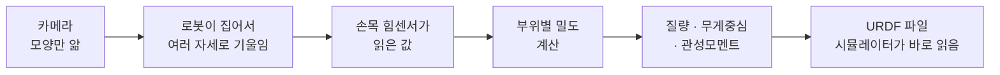
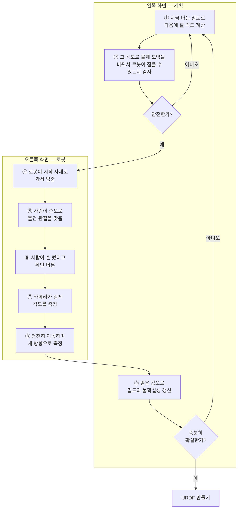
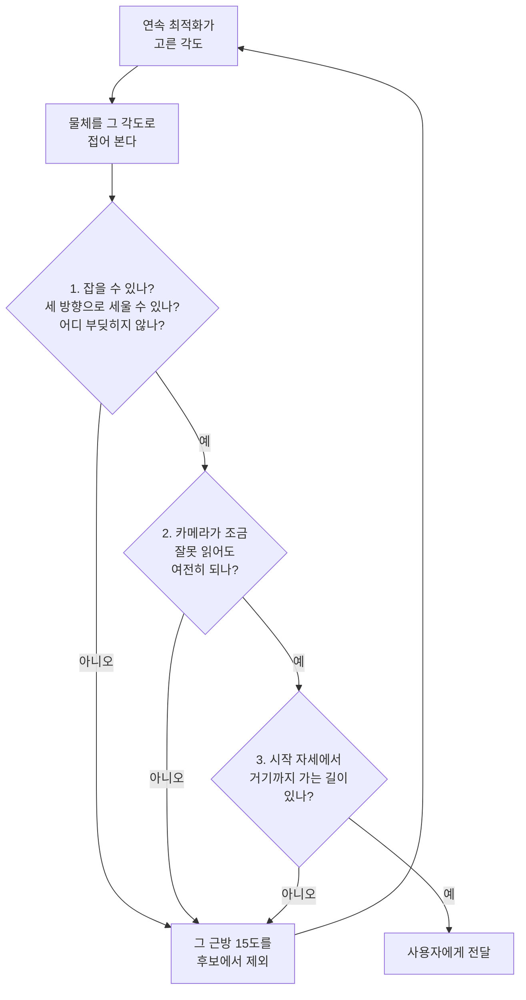
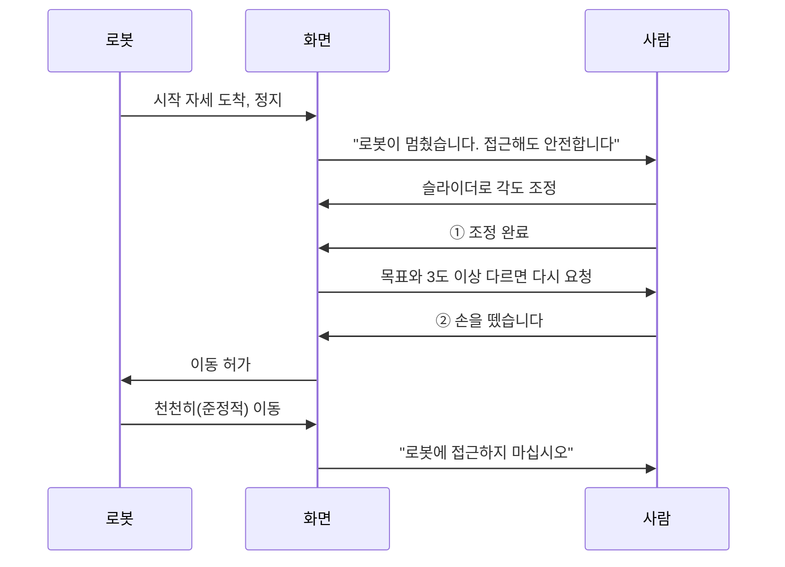
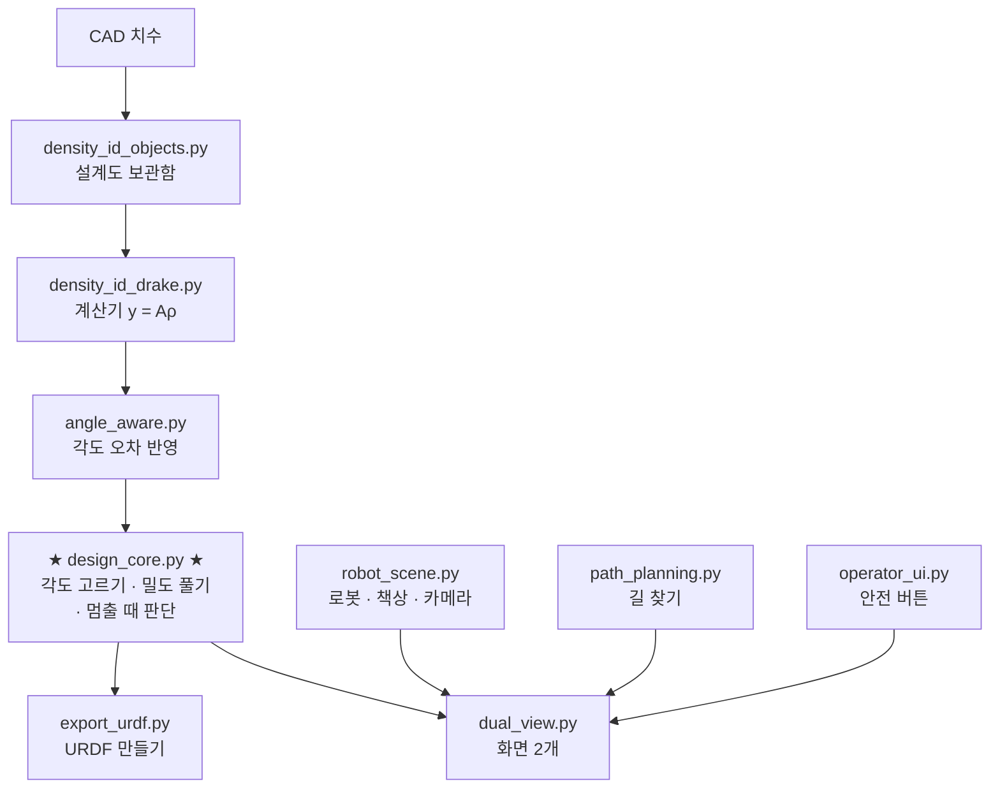
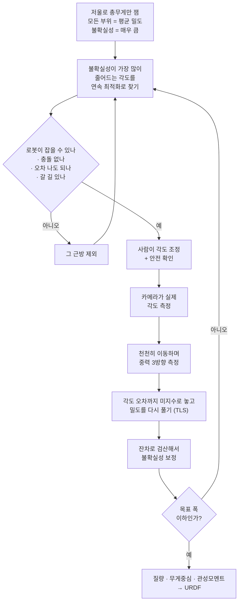

# 로봇이 물건을 만져보고 무게를 알아내는 법

> 접히는 물건을 로봇이 집어서 몇 번 기울여 보고, 각 부위가 얼마나 무거운지
> 알아내는 알고리즘입니다. 이 문서는 고등학생이 읽을 수 있게 쓴 설명서입니다.
> 수식은 꼭 필요한 것 하나만 씁니다.

---

## 1. 무엇을 하는 프로그램인가

로봇이 처음 보는 물건을 집었습니다. 노트북처럼 **접히는** 물건입니다.

이 물건을 컴퓨터 시뮬레이터 안에 똑같이 만들어 넣고 싶습니다. 그러려면
**각 부위가 얼마나 무거운지** 알아야 합니다. 노트북 화면 덮개가 100 g인지
500 g인지에 따라, 시뮬레이터 안에서 노트북이 넘어지는 모습이 완전히
달라지기 때문입니다.

문제는 **카메라로는 모양만 보인다**는 것입니다. 겉이 똑같아도 속이 빈
플라스틱일 수도, 납덩이가 들어 있을 수도 있습니다. 무게는 만져 봐야 압니다.

그래서 이렇게 합니다.



맨 마지막 URDF가 최종 산출물입니다. 시뮬레이터에게 주는 물체 설명서입니다.

---

## 2. 왜 어려운가 — 저울 하나로 셋을 재기

물건이 부위 3개(A, B, C)로 되어 있다고 합시다.

손목 센서는 **전체가 만드는 힘과 비틀림 하나**만 읽습니다. 부위별로 따로
알려주지 않습니다.

> 가방에 사과·배·귤을 넣고 통째로 저울에 올린 것과 같습니다.
> 총 1 kg인 건 알아도, 사과가 몇 g인지는 모릅니다.

### 그런데 관절을 접으면 달라집니다

가방을 손으로 들고 있다고 상상해 보세요.

- 사과를 손 **가까이** 옮기면 → 팔이 덜 힘듭니다
- 사과를 손에서 **멀리** 옮기면 → 팔이 더 힘듭니다

**무게는 그대로인데 손목이 느끼는 비틀림이 달라집니다.** 이 차이가 "사과가
얼마나 무거운가"를 알려줍니다.

물건의 관절 각도를 바꾸면 각 부위가 손목에서 얼마나 멀어지는지가 바뀝니다.
자세를 여러 번 바꿔 재면 연립방정식이 만들어집니다.

```
자세 1에서 재면 :  0.29·ρA + 0.21·ρB + 0.16·ρC = 측정값 1
자세 2에서 재면 :  0.29·ρA + 0.05·ρB − 0.11·ρC = 측정값 2
자세 3에서 재면 :  ...
```

앞의 숫자(0.29, 0.21, …)는 **부피와 위치에서 나오는 값**이라 CAD 도면과
카메라로 계산할 수 있습니다. 우리가 모르는 건 ρ(밀도)뿐입니다.

---

## 3. 딱 하나의 수식

```
y  =  A(θ) · ρ  +  잡음
```

| 기호 | 읽는 법 | 정체 |
| --- | --- | --- |
| `y` | 와이 | 손목 센서가 읽은 값. 힘 3개 + 비틀림 3개 = 숫자 6개 |
| `ρ` | 로 | **우리가 찾는 것.** 부위별 밀도 |
| `θ` | 세타 | 물건의 관절 각도. 사람이 손으로 맞춰 준다 |
| `A(θ)` | 에이 | 위 연립방정식의 계수표. 각도 θ에 따라 값이 바뀐다 |

`A(θ)`를 만드는 데는 **부피**와 **위치**만 있으면 됩니다. 밀도는 하나도
필요 없습니다. 그래서 정답을 몰라도 계수표를 만들 수 있습니다.

### 중력 방향 3개

로봇은 손목을 돌려 물건을 **아래·옆·앞** 세 방향으로 기울입니다.
한 번의 "라운드"마다 6 × 3 = **18개의 숫자**를 얻습니다.

```
     ↓ 아래로            → 옆으로            ↗ 앞으로
   ┌─────┐             ┌─────┐             ┌─────┐
   │     │             │     │──→          │     │↗
   └──┬──┘             └──┬──┘             └──┬──┘
      ↓ g                 g                    g
   숫자 6개             숫자 6개             숫자 6개
```

---

## 4. 전체 흐름

프로그램은 화면 두 개를 띄웁니다. **왼쪽은 계획**, **오른쪽은 로봇**입니다.



굵은 고리 두 개가 있습니다.

- **안쪽 고리** (①→②→③→①) : 안전한 자세가 나올 때까지 다시 찾기
- **바깥 고리** (①→…→⑨→⑩→①) : 충분히 확실해질 때까지 측정 반복

---

## 5. 불확실성이란 무엇인가

프로그램은 밀도를 **숫자 하나로** 갖고 있지 않습니다.

```
"5200쯤인데, ±120 정도는 모르겠다"
```

이 **폭**이 불확실성입니다. 측정할 때마다 폭이 줄어들고, 목표(예: ±1%)보다
작아지면 멈춥니다.

### 폭은 방향마다 다릅니다

여기가 핵심입니다. 부위가 3개면 밀도는 3차원 공간의 점입니다. 불확실성은
그 점을 감싼 **럭비공 모양의 구름**입니다.

```
        길쭉한 방향 = 잘 모르는 방향
              ↕
        ╭──────────────╮
       │   ● 추정값     │  ← 납작한 방향 = 잘 아는 방향
        ╰──────────────╯
```

물건을 저울에 올려 총무게만 잰 상태에서 시작하면 이렇습니다.

```
방향 1   폭 196.0%   ← 완전히 모름  (부위끼리 어떻게 나눠 갖는지)
방향 2   폭 196.0%   ← 완전히 모름
방향 3   폭   0.4%   ← 저울이 채워준 것  (총무게)
```

**저울은 "합"만 알려줍니다.** 그 합을 셋이 어떻게 나눠 갖는지는 전혀 모릅니다.
텅 빈 두 방향이 그것입니다.

### 측정이 빈 방향을 하나씩 메웁니다

실제 실행에서 이렇게 됩니다.

```
시작        [196.0%] [196.0%] [0.392%]
              ↓ round 1 측정
round 1     [ 46.7%] [ 0.122%] [0.019%]      ← 하나 메워짐
              ↓ round 2 측정
round 2     [ 0.292%] [0.092%] [0.014%]      ← 마지막도 메워짐
                                              → 목표 도달, 종료
```

**부위 3개 = 방향 3개.** 저울이 1개를 채우고, 측정이 2개를 메웁니다.
그래서 정확히 **2라운드**에 끝납니다. 우연이 아니라 차원 수에서 나옵니다.

---

## 6. 다음에 잴 각도를 어떻게 고르나

아무 각도나 재면 되는 게 아닙니다. **어떤 각도는 정보를 많이 주고 어떤 각도는
거의 안 줍니다.**

### 왜 그런가 — 문 경첩 이야기

```
경첩 축이 눕혀져 있으면              경첩 축이 세워져 있으면
(중력과 수직)                        (중력과 나란함)

     ═══╤═══                              ║
        │  ↓ 무게가                       ║  ↓ 무게가
        │    경첩을 비튼다                ║    아래로만 눌린다
        ▼                                 ▼
   비틀림 크다 → 잘 보인다          비틀림 = 0 → 안 보인다
```

관절 축과 중력이 나란해지면 그 아래 있는 부위가 만드는 비틀림이 0이 됩니다.
아무리 재도 그 부위 무게는 안 보입니다.

### 그래서 매 라운드 이렇게 합니다

> "지금 내가 아는 밀도가 이 정도라면, 각 각도에서 재면 불확실성 구름이
> 얼마나 줄어들까?" 를 계산해 보고, 가장 많이 줄어드는 각도를 고른다.

각도는 원래 **연속적인 값**입니다. 예전에는 5칸씩 잘라 격자를 깔고 그중에서
골랐는데, 지금은 격자에 얽매이지 않고 미끄러지듯 최적점을 찾아갑니다.

```
격자 방식                     연속 최적화
  ·  ·  ·  ·  ·                    ╱
  ·  ·  ●  ·  ·   ← 점 위에서만    ╱  ★  ← 어디든 갈 수 있다
  ·  ·  ·  ·  ·      고를 수 있다ㅤ╱
```

격자를 441칸으로 잘게 썬 것보다 나은 답을 절반의 계산으로 찾습니다.

---

## 7. 고른 각도가 실제로 쓸 수 있는지 검사

계산이 "이 각도가 최고"라고 해도, **로봇이 그 모양의 물건을 잡을 수 없으면
소용없습니다.** 그래서 세 단계로 검사합니다.



### 2번이 왜 필요한가

사람이 45도로 맞춰도 실제로는 44.7도일 수 있고, 카메라가 그걸 45.3도로
읽을 수도 있습니다. **로봇은 실제 각도를 알 방법이 없습니다.**

명령한 각도 하나만 확인하고 보내면, 카메라가 조금 다르게 읽는 순간 로봇이
못 잡아서 그 라운드가 통째로 날아갑니다. 그래서 **오차 범위의 모서리까지
전부** 확인합니다.

### 3번이 왜 필요한가

"그 자세로 서 있을 수 있나"와 "거기까지 갈 수 있나"는 **다른 문제**입니다.
길이 막혀 있으면 사람이 이미 각도를 다 맞춘 뒤에 알게 되어 헛수고가 됩니다.

```
       시작 자세                         탐색 자세
          ●━━━━━━━━━━━━ ✗ ━━━━━━━━━━━━━━━━●
                    책상에 걸림
          ●━━╮                        ╭━━●
              ╰━━━━━━━━━━━━━━━━━━━━━━╯     ← 돌아가는 길을 찾는다
```

미로 찾기와 같습니다. 무작위로 점을 뿌려가며 부딪히지 않는 길을 잇습니다.

---

## 8. 밀도를 어떻게 푸나 — 이 프로젝트에서 가장 중요한 부분

연립방정식을 푸는 건데, **계수표 `A(θ)` 자체가 조금 틀려 있습니다.**
카메라가 각도를 ±5% 오차로 재주기 때문입니다.

### 영수증 비유

> `총액 = 개수 × 단가` 에서 단가를 구하려고 합니다.
> 그런데 **개수를 세는 사람이 가끔 틀립니다.**

**옛날 방식 (WLS)** — 개수는 맞다고 치고, 개수가 틀린 몫을 "총액 쪽 오차"로
떠넘깁니다. 그러면 단가가 한쪽으로 **치우칩니다.**

**지금 방식 (TLS)** — 개수도 미지수로 놓고 단가와 **같이** 풉니다.
"개수가 틀렸을 수 있다"가 계산에 들어가므로 치우침이 사라집니다.

### 왜 치우침이 무서운가 — 과녁 비유

```
   흔들림 (없어짐)                 치우침 (안 없어짐)

        ┌───────┐                    ┌───────┐
        │  ·  · │                    │       │  ●●
        │ · ◎ · │  100발 쏘면        │   ◎   │ ●●●   조준경이
        │  ·  · │  중심이 맞는다     │       │  ●●   틀어져 있으면
        └───────┘                    └───────┘  1000발을 쏴도
                                                 계속 오른쪽
```

**흔들림**은 여러 번 재서 평균내면 사라집니다.
**치우침**은 아무리 많이 재도 안 사라집니다.

### 실험 결과

같은 데이터를 두 방법에 똑같이 먹이고, 40번 반복한 결과입니다.

```
측정 횟수    WLS 치우침    TLS 치우침
    1회        1.58%         1.14%
    2회        0.59%         0.01%
    3회        1.88%         0.00%
    5회        1.52%         0.00%
    8회        1.41%         0.01%   ← WLS는 8번을 재도 그대로
```

**WLS는 2회(0.59%)보다 8회(1.41%)가 더 나쁩니다.** 더 많이 잰다고 좋아지지
않습니다. 그래서 계산 방법 자체를 바꿔야 했습니다.

---

## 9. 언제 멈추나

실제 상황에서는 **정답을 모릅니다.** 그러니 "내가 얼마나 확신하는가"만 보고
멈출지 정해야 합니다.

문제는 그 확신이 거짓일 수 있다는 것입니다. 시험을 보고 "다 맞은 것 같다"고
했는데 실제로는 반만 맞은 상황입니다.

### 검산하기

```
예측한 손목 값  vs  실제로 읽은 손목 값
        └──────── 이 차이가 "잔차" ────────┘
```

계산이 맞다면 이 차이가 센서 잡음 정도여야 합니다. 실제 차이가 5배 크다면
**"내 잡음 모형이 5배 낙관적이었다"**는 뜻이고, 그만큼 폭을 넓힙니다.

**정답을 몰라도 계산됩니다.** 예측값과 측정값은 둘 다 손에 있으니까요.

### 효과

"95% 확률로 이 범위 안에 있다"고 말했을 때, 실제로 그 안에 들어온 비율입니다.
(150번 반복해서 채점)

```
                 검산 안 함    검산 함
   옛날 방식        3%          3%      ← 못 고침
   지금 방식       88%         99%      ← 제자리를 찾음
```

**옛날 방식은 정지 조건만 손봐서는 못 구합니다.** 오차가 흔들림이 아니라
치우침이라, 범위를 아무리 넓혀도 "언제 멈춰도 틀린" 상태가 "틀렸다고
인정하는" 상태로 바뀔 뿐입니다.

---

## 10. 사람의 안전

물건 각도는 **사람이 손으로** 맞춥니다. 로봇 옆에 사람이 있는 상황이므로
안전이 최우선입니다.



세 가지 규칙이 코드에 박혀 있습니다.

1. **시작 자세에서 로봇은 절대 안 움직입니다.** 사람이 손대는 동안 정지.
2. **버튼 두 개를 눌러야** 이동이 시작됩니다. 각도 확인 → 손 뗌 확인.
3. **천천히 움직입니다.** 빨리 움직이면 가속도 때문에 관절이 흐를 수 있고,
   센서가 중력 말고 다른 것도 읽습니다. 관성 힘이 중력 힘의 1% 미만이
   되도록 이동 시간을 잡습니다.

---

## 11. 실제 결과

3-link 실물 (부위 3개, 관절 2개, 길이 353 mm)

```
출발: 저울로 총무게 1903.6 g 만 앎
      → 모든 부위를 평균 밀도 2889 kg/m³ 로 시작

round 1: 각도 [33.8°, 52.3°] 로 측정   → 폭 37.6%
round 2: 각도 [43.3°, 180°] 로 측정    → 폭  0.25%   목표 도달

              추정값     정답      오차
link0_base    5200.7    5200     0.01%
link1_elbow   1399.8    1400     0.02%
link2_tip      699.8     700     0.03%
```

**정답은 채점에만 썼습니다.** 각도를 고를 때도, 밀도를 풀 때도, 멈출지
판단할 때도 정답은 쓰지 않습니다.

### 걸리는 시간

```
프로그램 시작 준비        4.6초  (한 번만)
──── 이하 라운드마다 ────
다음 각도 계산            0.5초
사람이 각도 조정        20~60초   ← 사람
로봇 이동 4회           이동시간 × 4
측정                       3초
```

한 라운드에 **1~2분**, 전체 **3~4분**입니다.

---

## 12. 한계

**부위 4개까지가 현실적입니다.**

```
부위 3개 :  2회 측정,  오차 0.1%      ← 지금 물체
부위 4개 :  3.5회,     오차 0.25%
부위 5개 : 10.5회,     오차 0.5%      ← 아슬아슬
부위 6개 : 12회에도 못 끝남, 오차 5%
```

부위가 늘면 미지수는 늘어나는데 손목 센서가 주는 숫자는 그대로 18개입니다.
게다가 끝쪽 부위는 가볍고 손목에서 멀어서, 무게가 조금 달라져도 센서 값이
거의 안 변합니다.

**계산 방법을 바꿔서 해결될 문제가 아닙니다.** 카메라 각도 정밀도(현재 ±5%)를
올려야 합니다.

### 다루는 물체의 조건

**사람이 각도를 맞춰 두면 그대로 고정되는 물건**만 다룹니다.
노트북, 스탠드형 램프, 폴더블 폰 같은 것입니다.

각도가 흐르면 계수표가 틀려져서 추정이 망가집니다.

---

## 13. 코드 지도



| 파일 | 하는 일 | 비유 |
| --- | --- | --- |
| `density_id_objects.py` | CAD 치수를 코드로 | 설계도 보관함 |
| `density_id_drake.py` | `y = A(θ)ρ` 계산 | 계산기 |
| `angle_aware.py` | 각도 오차를 반영 | 오차 담당 |
| **`design_core.py`** | **각도 고르기 · 밀도 풀기 · 정지 판단** | **두뇌** |
| `robot_scene.py` | 로봇·그리퍼·책상·카메라 배치, IK | 작업장 관리인 |
| `path_planning.py` | 부딪히지 않는 길 찾기 | 길 안내 |
| `operator_ui.py` | 신호등·버튼·슬라이더 | 안전 요원 |
| `dual_view.py` | 전체를 화면 두 개로 | 감독 |
| `export_urdf.py` | URDF 생성 + 검증 | 포장 담당 |
| `nlink.py` | 부위 2~8개 가짜 물체 | 연습문제 출제자 |

### 검증 스크립트

설계를 결정할 때 쓴 실험들입니다. 각각 표를 찍고 그림을 남깁니다.

| 파일 | 비교 대상 | 결과 그림 |
| --- | --- | --- |
| `study_continuous.py` | 격자 vs 연속 최적화 | `study_continuous.png` |
| `study_tilt.py` | 어느 방향으로 기울일까 | `study_tilt.png` |
| `study_tls.py` | WLS vs TLS | `study_tls.png` |
| `study_criterion.py` | D vs A vs E 기준 | `study_criterion.png` |
| `study_stopping.py` | 언제 멈출까 | `study_stopping.png` |

---

## 14. 실행법

```bash
cd ~/Desktop/HTD-main/my_work
```

**로봇 없이 숫자만** (20초, 조작 없음)

```bash
../robot_learning/scripts/run_drake_env.sh python export_urdf.py --object 3link
```

**전체 과정을 화면으로** (3~4분, 직접 조작)

```bash
../robot_learning/scripts/run_drake_env.sh python dual_view.py \
    --object 3link --joint-range-deg 0 180 \
    --target 0.01 --max-rounds 8 --move-duration 8
```

브라우저 탭 두 개(`localhost:7000`, `localhost:7001`)를 나란히 여세요.

**설계 선택을 바꿔 보기**

| 스위치 | 값 | 뜻 |
| --- | --- | --- |
| `--select` | `continuous` / `grid` | 각도 고르는 법 |
| `--criterion` | `D` / `A` / `E` | 이득을 재는 자 |
| `--estimator` | `tls` / `wls` | 밀도 푸는 법 |
| `--stop-rule` | `residual` / `variance` / `bias` | 멈출 때 판단 |

---

## 15. 자주 나오는 질문

**Q. 정답을 몰래 쓰고 있는 건 아닌가요?**

정답은 두 군데만 나옵니다. (1) 가짜 측정값을 만들 때 — 실제 상황에서는
진짜 물건이 대신하는 역할입니다. (2) 맨 마지막 채점.
각도를 고르거나, 밀도를 풀거나, 멈출지 판단할 때는 절대 안 씁니다.

**Q. 왜 중력 방향이 3개인가요?**

공간이 3차원이기 때문입니다. 서로 직각인 세 방향을 쓰면 공간을 빠짐없이
훑게 됩니다. 4개, 6개로 늘려도 이득이 거의 안 늡니다.

재미있는 사실이 하나 있습니다. **직각인 3방향을 쓰는 한, 그 세트를 통째로
어떻게 회전시켜도 얻는 정보량이 정확히 같습니다.** 하나가 안 보이는 방향에
빠지면 나머지 둘이 그만큼 잘 보이는 자리로 옮겨가기 때문입니다.

**Q. 왜 딱 2라운드에 끝나나요?**

부위 3개 = 방향 3개이고, 저울이 1개(총무게)를 채워주기 때문입니다.
남은 2개를 측정이 하나씩 메웁니다. (5장 참고)

**Q. `준정적`이 무슨 뜻인가요?**

"거의 정지한 것처럼"입니다. 빨리 움직이면 가속도 때문에 관성력이 생겨
센서가 중력 말고 다른 것도 읽습니다.

**Q. IK가 뭔가요?**

역기구학. "손끝을 여기에 두려면 팔 관절을 몇 도씩 꺾어야 하나"를 푸는
것입니다. 사람은 무의식으로 하지만 로봇은 계산해야 합니다.

이 계산은 **출발점에서 시작해 근처 답을 찾아가는** 방식이라, 같은 각도라도
어디서 출발했느냐에 따라 성공하기도 실패하기도 합니다. 그래서 코드는
출발점을 바꿔가며 여러 번 시도합니다. 이걸 넣기 전에는 격자 25칸 중
18칸만 통과했는데, 넣은 뒤에는 25칸 전부 통과합니다.

---

## 부록: 알고리즘 한 장 요약


