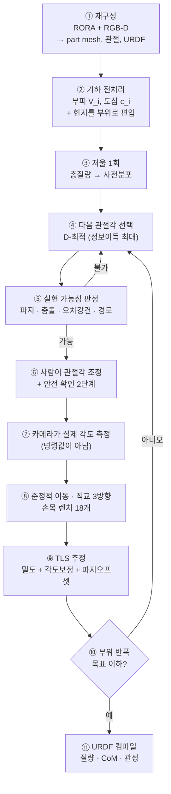

# 이 연구가 왜 이론적 기여를 갖는가 — 파이프라인 단계별 정리

> **읽는 순서**: 1장에서 기존 방향과의 차이를, 2장에서 이론의 내용을,
> 3장에서 파이프라인을, 4장에서 **각 단계에 이론이 어떻게 들어가는지**를 봅니다.
> 5장은 예상 질문입니다.
>
> 증명은 [theory.tex](theory.tex), 유도 과정은 [THEORY.md](THEORY.md),
> 수치 검증은 [study_theory.py](study_theory.py) 에 있습니다.

---

## 1. 기존 연구는 어느 방향으로 가고 있었나

이 문제 — "물체의 부위별 질량을 어떻게 알아내는가" — 를 다루는 흐름은 크게 셋입니다.

| 흐름 | 대표 | 어떻게 푸는가 | 무엇이 남는가 |
| --- | --- | --- | --- |
| **A. 보고 추측** | NeRF2Physics, GaussianProperty, PUGS, PhysGS, SiPhy | 겉모습·재질·언어 사전지식으로 밀도를 추론 | 실물을 안 만져 봄. 겉이 같고 속이 다른 물체를 구별 못 함 |
| **B. 만져 보되 강체로** | Scalable Real2Sim, Sum of Its Parts | 로봇이 들고 흔들어 F/T 를 재고 관성을 역산 | 물체를 **형상 고정**으로 다룸. 부위 분해는 가정으로 메움 |
| **C. 관절을 탐색하되 기구학만** | Hausman ICRA'15, Martín-Martín IJRR'22 | 밀어 보며 관절 축·타입을 알아냄 | **질량이 아니라 기구학**. 밀도는 대상이 아님 |

### 우리는 어디에 있나

**B 와 C 사이의 빈칸입니다.** "만져 봐서(B) 부위별 질량을(B) 알아내되, 물체의
관절을 능동적으로 접어가며(C) 한다."

그런데 이것만으로는 *"조합이 새롭다"* 는 말밖에 안 됩니다. 조합의 새로움은
ICRA 에서 기여로 인정받기 약합니다. **진짜 차이는 설계 변수가 뒤집혔다는
것입니다.**

```
고전 여기설계 (Swevers'97 이후 30년)      우리
─────────────────────────────────       ─────────────────────────────
설계 변수 = 로봇의 궤적 q(t)             설계 변수 = 물체의 관절 형상 θ
물체 = 고정된 단일 강체 페이로드          물체 = 형상이 바뀌는 관절체
q 는 엔코더로 정확히 안다                 θ 는 카메라로 오차를 갖고 읽는다
페이로드 형상 고정 → 파지 가능성 불변      θ 가 형상을 바꿈 → 매번 재판정
```

이 뒤집힘이 고전 설정에 **없던 세 가지**를 만듭니다.

1. **θ 는 로봇이 구동하지 않습니다.** 마찰 유지 관절이라 사람이 맞춥니다.
   *반(半)제어 설계변수*입니다.
2. **설계변수 자체가 오차원(EIV)입니다.** θ 를 비전으로 재므로 설계와 추정이
   결합됩니다. 고전 설계는 `q` 를 정확히 안다고 가정하므로 이 결합이 없습니다.
3. **가용집합이 조작 가능성으로 정의됩니다.** θ 가 바뀌면 물체 형상이 바뀌어
   파지·IK·충돌·경로가 전부 바뀝니다.

> **여기까지는 "새로운 문제 설정"이지 아직 이론 기여가 아닙니다.**
> 이걸 먼저 인정하고 2장으로 넘어가는 것이 설득에 유리합니다.

---

## 2. 그래서 이론적 기여는 무엇인가

측정 모형을 그대로 전개했더니 **정보행렬이 닫힌 형태로 떨어졌습니다.** 그리고
거기서 "이 문제로 무엇을 알 수 있고 무엇을 알 수 없는가"가 전부 나왔습니다.

### 2.1 출발 — 기호 두 개

```
v    = (V_1, ..., V_P)ᵀ                 부피 벡터        (P차원)
C(θ) = [ V_1 c_1(θ), ..., V_P c_P(θ) ]  부피가중 도심행렬 (3 x P)
```

`V_i` 는 부위 i 의 부피, `c_i(θ)` 는 손목 기준 도심입니다. 둘 다 **밀도 없이**
계산됩니다. 회귀행렬은

```
A(θ, ĝ) = g [  ĝ vᵀ      ]      ĝ = 중력 단위벡터
            [ -[ĝ]ₓ C(θ) ]
```

### 2.2 정리 1 — 정보행렬의 닫힌 형태

직교정규 삼면체 `{ĝ₁,ĝ₂,ĝ₃}` 에 대해 `Σₖ ĝₖĝₖᵀ = I` 를 쓰면

```
M(θ) = g² [ (3/σ_f²)·v vᵀ  +  (2/σ_τ²)·C(θ)ᵀ C(θ) ]
```

**증명은 두 줄입니다.** 그리고 이 식에서 세 가지가 즉시 따라옵니다.

| 따라오는 것 | 무슨 뜻인가 |
| --- | --- |
| `ĝ` 가 식에서 사라짐 | **기울임 방향은 정보량에 영향이 없다.** 설계공간이 `Θ×SO(3)` → `Θ` |
| `ρ` 가 식에 없음 | 정보량이 **형상만으로** 결정된다 → 각도가 정확하면 개루프로 충분 |
| 힘 항이 `v vᵀ` 하나뿐 | **힘 채널은 저울과 중복.** 정보는 전부 토크에서 온다 → `σ_τ` 가 구속 사양 |

### 2.2-b 정리 1을 말로 옮기면 — 센서가 보는 건 숫자 4개뿐

> **발표에서는 이 절만 말해도 됩니다.** 수식보다 이 설명이 훨씬 잘 통합니다.

물체를 한 자세로 고정해 놓고 손목 힘/토크를 재면, **아무리 여러 방향으로
기울여도** 알아낼 수 있는 것은 둘뿐입니다.

```
  ① 총질량            숫자 1개
  ② 무게중심 위치      숫자 3개  (x, y, z)
                     ─────────
                     합해서 4개
```

힘은 `f = (총질량)·g·ĝ` 라 방향을 바꿔도 총질량 하나만 말해 주고, 토크는
`τ = (총질량)·(무게중심 × g)` 라 무게중심 3개를 말해 줍니다. **그 이상은
물리적으로 없습니다.** 10번 기울여도, 100번 반복해도 여전히 4개이고
잡음만 줄어듭니다. 이것이 `rank M(θ) ≤ 4` 입니다.

### 안 보이는 것의 구체적인 예 — 이 표 하나면 설명이 끝납니다

부위 3개가 손목에서 각각 10 / 20 / 30 cm 떨어져 있다고 합시다.
질량을 이렇게 옮겨 봅니다.

```
                  10cm       20cm       30cm
   옮기는 양      +100 g     −200 g     +100 g

   총질량 변화 :  100 − 200 + 100 = 0                  → 저울이 못 봄
   모멘트 변화 :  100×10 − 200×20 + 100×30
                = 1000 − 4000 + 3000 = 0               → 토크가 못 봄
```

**질량 분포가 완전히 달라졌는데 센서 값이 하나도 안 변합니다.**

여기서 **관절을 접어** 세 번째 부위가 30 cm → 15 cm 로 들어오면:

```
   모멘트 변화 :  1000 − 4000 + 100×15 = −1500 ≠ 0     → 이제 보임
```

> **관절을 접는 것이 숨어 있던 것을 드러내는 유일한 수단입니다.**
> 더 좋은 카메라도, 더 정밀한 센서도, 더 많은 반복도 이걸 못 합니다.

### 라운드 하한도 같은 그림에서 나옵니다

자세를 하나 바꾸면 총질량은 그대로이므로 **무게중심 3개만 새로** 얻습니다.

```
   자세 R 개를 재면 얻는 숫자 = 1 (총질량) + 3R (무게중심들)
   미지수 P 개를 풀려면       1 + 3R ≥ P     ⇒   R ≥ ⌈(P−1)/3⌉
```

| | 미지수 | 필요한 자세 수 | 실제 라운드 |
| --- | ---: | ---: | ---: |
| **2-link** | 3 (부위 2 + 힌지 1) | `⌈2/3⌉ = 1` | **1** ✓ |
| **3-link** | 5 (부위 3 + 힌지 2) | `⌈4/3⌉ = 2` | **2** ✓ |

3-link 는 미지수 5개인데 한 자세로는 4개밖에 못 얻으니 **두 자세가 반드시
필요**하고, 실제로 두 라운드에 끝납니다. 그리고 이 예측은 **측정을 시작하기
전에 형상만으로** 계산됩니다 (정보행렬에 밀도가 없으므로).

### 2.3 정리 2 — rank 천장 4, 그리고 영공간

`C` 가 3×P 이므로

```
rank M(θ)  ≤  1 + rank C(θ)  ≤  4
```

이고, 이는 **중력 방향을 몇 개 쓰든, 몇 번 반복하든** 성립합니다.

> **따름정리 (강체 한계)** — 형상을 고정하면 rank 는 영원히 4 이하다.
> 즉 **부위가 5개 이상인 강체는 원리적으로 식별 불가능하다.**

영공간도 정확히 나옵니다.

```
null M(θ) = { u :  Σ u_i V_i = 0   그리고   Σ u_i V_i c_i(θ) = 0 }
```

> **총질량과 1차 모멘트를 동시에 보존하는 질량 재분배는 보이지 않는다.**

정지 렌치는 질량 분포의 **0차·1차 모멘트만** 봅니다. 이건 알고리즘의 한계가
아니라 **측정 물리의 한계**이고, 어떤 추정기를 써도 안 바뀝니다.

### 2.4 정리 3 — 라운드 하한과 n-link 법칙

```
rank M_R ≤ 1 + min(3R, P)      ⇒   R ≥ ⌈(P−1)/3⌉
```

링크 `p` 개 + 관절마다 힌지인 직렬 사슬은 미지수가 `P = 2p−1` 이므로

```
R ≥ ⌈(2p−2)/3⌉
```

**이 값이 실물 두 물체의 관측 라운드 수를 정확히 맞힙니다.**

```
  p=2 (2-link):  P=3  단일형상 rank 3   하한 1   관측 1  ✓
  p=3 (3-link):  P=5  단일형상 rank 4   하한 2   관측 2  ✓
```

### 2.5 그래서 무엇이 기여인가 — 한 문장

> **"정지 렌치 측정으로 부위별 밀도를 알아내는 문제의 정보 구조를 완전히
> 규정했다"** 는 것입니다. 무엇이 보이고(rank ≤ 4), 무엇이 안 보이며
> (질량·1차모멘트 보존 재분배), 몇 번을 재야 하고(⌈(P−1)/3⌉), 무엇을
> 설계해야 하는가(θ 만, ĝ 는 무관) — 이 넷이 전부 한 식에서 나옵니다.

그리고 **가장 값어치 있는 문장**은 이것입니다.

> **관절을 접는 것은 "도움이 되는 선택"이 아니라 부위가 넷을 넘는 순간
> 수학적 필요조건이 된다.** 우리 방법이 관절체에 특화된 것은 공학적 취향이
> 아니라 정리에서 강제된 것이다.

---

## 3. 파이프라인 — 전체 그림



바깥 고리(③→⑩→③)가 **능동 탐색 루프**, 안쪽 고리(④→⑤→④)가
**실현 가능성 되찾기 루프**입니다.

---

## 4. 각 단계에 이론이 어떻게 들어가는가 ★ 핵심

**이 장이 "이론이 장식이 아니라 설계를 결정한다"를 보이는 부분입니다.**
각 단계마다 (a) 필요한 개념, (b) 이론이 어떻게 적용되는가, (c) 이론이 없었다면
무엇을 잘못했을까 를 씁니다.

---

### 단계 ① 재구성 — part mesh, 관절, URDF

- **필요 개념**: 3DGS 재구성, part 분할, 관절 축 추정, metric scale
- **이론의 역할**: 여기는 **이론이 요구사항을 규정하는** 단계입니다.
  정리 1의 `M(θ) = a·vvᵀ + b·CᵀC` 에서 정보는 오직 `v`(부피)와 `C`(도심)로만
  들어옵니다. 즉 **재구성이 정확해야 하는 것은 겉모습이 아니라 부피와 도심**
  입니다.
- **이론이 없었다면**: 재구성 품질을 렌더링 지표(PSNR 등)로 관리했을 것입니다.
  실제로 관리해야 하는 것은 **도심 오차**입니다 (5 mm 어긋나면 질량 42% 오차).

### 단계 ② 기하 전처리 — 부피·도심, 그리고 힌지 편입

- **필요 개념**: watertight mesh, 부피 적분, 도심 적분, 볼록 분해
- **이론의 역할**: 정리 2의 영공간 특성화가 **"모형에 없는 질량"이 왜 치명적
  인지**를 설명합니다. 힌지 41 g 이 저울에는 올라가는데 `v` 에 없으면, 그
  질량 몫이 갈 곳이 없어 다른 부위 밀도로 흘러듭니다. 이건 잡음이 아니라
  **모형 오설정**이므로 라운드를 늘려도 안 사라집니다.
- **이론이 없었다면**: "힌지는 41 g 밖에 안 되니 무시하자"고 판단했을 것입니다.
  실제로는 3-link 에서 **23% 오차**가 나면서 알고리즘은 0.38% 라고 주장합니다
  (60배 과신).

### 단계 ③ 저울 1회 — 사전분포 초기화

- **필요 개념**: 베이지안 사전분포, 총질량 구속
- **이론의 역할**: 정리 1의 **힘 채널 = `v vᵀ` 하나뿐**이라는 결과가,
  저울이 채워주는 방향과 F/T 힘 채널이 **정확히 같은 방향**임을 말합니다.
  그래서 저울은 `P` 차원 중 **정확히 1차원**을 채우고, 나머지 `P−1` 을
  측정이 메워야 합니다. 정리 3의 `⌈(P−1)/3⌉` 에서 `−1` 이 바로 이것입니다.
- **이론이 없었다면**: 저울을 "정확도를 좀 올려주는 보조 측정"으로 봤을
  것입니다. 실제로는 **차원 하나를 정확히 소비하는 구조적 구속**입니다.

### 단계 ④ 다음 관절각 선택 — D-최적 ★ 이론이 가장 직접적으로 쓰이는 곳

- **필요 개념**: Fisher 정보행렬, D-최적 설계, 연속 최적화
- **이론의 역할**: **세 겹으로 들어갑니다.**

  1. **탐색 공간을 정리 1이 결정합니다.** 삼면체 회전 불변성 때문에 `ĝ` 는
     목적함수에서 사라집니다. 그래서 `Θ × SO(3)` 가 아니라 **`Θ` 위에서만**
     최적화합니다. 이게 없으면 탐색 공간이 3차원 더 커지고, 게다가 그 3차원은
     **아무 이득도 없는 방향**입니다.

  2. **무엇을 최대화할지를 정리 2가 결정합니다.** 목표는 영공간
     `{u : vᵀu = 0, C(θ)u = 0}` 을 가장 빨리 붕괴시키는 것이고, 이는
     `C(θ_r)` 들의 행공간이 서로 상보적이 되게 하는 것과 같습니다.
     D-최적(`logdet`)이 이 목적에 맞는 이유가 여기서 나옵니다.

  3. **몇 라운드를 예산으로 잡을지를 정리 3이 결정합니다.**
     `⌈(P−1)/3⌉` 이 하한이므로, 그보다 적은 예산은 애초에 불가능합니다.

- **이론이 없었다면**: 중력 방향까지 같이 최적화했을 것이고(헛수고),
  기준(D/A/E)을 순전히 실험으로만 골랐을 것이며, 라운드 예산의 근거가
  없었을 것입니다.

### 단계 ⑤ 실현 가능성 판정 — 파지·충돌·경로

- **필요 개념**: IK, 충돌 검사, RRT-Connect 경로 계획, 각도 오차 구간
- **이론의 역할**: 여기는 **이론이 "왜 이 단계가 필요한지"를 규정**합니다.
  고전 여기설계에는 이 단계가 아예 없습니다 — 페이로드가 강체라 형상이 안
  변하기 때문입니다. 우리는 설계 변수 `θ` 가 **물체의 형상 자체**이므로,
  최적점이 물리적으로 실현 불가능할 수 있습니다. 즉 이 단계는
  **"설계 변수를 물체 형상으로 삼은 대가"** 이고, 그래서 1장에서 말한
  세 번째 차이(가용집합의 형상 의존)의 구현체입니다.
- **이론이 없었다면**: 실현 가능성을 "구현 디테일"로 취급해 논문에서
  뺐을 것입니다. 실제로는 **문제 설정에서 유도되는 필수 구성요소**입니다.

### 단계 ⑥⑦ 사람 조정 + 카메라 각도 측정

- **필요 개념**: 관절 관측성 (px/deg), 핸드아이 캘리브레이션, 안전 인터록
- **이론의 역할**: 정리 1의 **"`M` 에 `ρ` 가 없다"** 가 여기서 뒤집힙니다.
  각도가 정확하다면 계획을 오프라인에 다 세울 수 있는데, 각도를 **측정**하기
  때문에 유효 잡음이 `R_eff = R + J(ρ)Σ_θJ(ρ)ᵀ` 가 되고 여기 `ρ` 가
  들어옵니다. **즉 폐루프가 필요한 유일한 이유가 이 단계입니다.**
- **이론이 없었다면**: "폐루프가 당연히 좋다"고 막연히 주장했을 것입니다.
  이제는 *"각도 오차가 없으면 폐루프가 필요 없다"* 는 것까지 말할 수 있고,
  이게 리뷰어의 "왜 미리 계산하지 않나" 질문에 대한 완결된 답입니다.

### 단계 ⑧ 준정적 측정 — 직교 3방향

- **필요 개념**: 준정적 가정, 관성력 대 중력 비, 타어링
- **이론의 역할**: **왜 3방향인가**를 정리 1이 답합니다. 직교 3방향이면
  `Σĝĝᵀ = I` 가 되어 정보행렬이 방향 배치와 무관해지고 닫힌 형태가 됩니다.
  4개, 6개로 늘려도 `KI − Σĝĝᵀ` 의 구조상 **새 방향이 안 생깁니다**
  (rank ≤ 1 + rank C 는 그대로).
- **이론이 없었다면**: 방향 개수와 배치를 실험으로 튜닝했을 것입니다.
  이제는 "3개면 충분하고, 배치는 무관하다"가 **증명된 사실**입니다.

### 단계 ⑨ TLS 추정 — 밀도 + 각도보정 + 파지오프셋

- **필요 개념**: 오차변수(EIV) 모형, 총최소제곱, MAP, 박스 제약
- **이론의 역할**: 각도 오차가 `y` 가 아니라 `A` 를 틀리게 한다는 구조적
  사실이 **편향(bias)** 을 만듭니다. 편향은 라운드를 늘려도 안 없어집니다
  (측정 8회의 WLS 편향 1.41% 가 1회의 1.58% 와 사실상 같음).
  그래서 각도 보정량을 미지수로 함께 푸는 TLS 가 필요합니다.
- **정직한 위치**: **EIV/TLS 자체는 기존 결과입니다** (IDIM-TLS 계열).
  우리 기여는 *"오차원이 다름 아닌 설계변수 자신"* 이라는 결합 구조이지,
  TLS 라는 도구가 아닙니다. 이 구분을 논문에서 명시해야 합니다.

### 단계 ⑩ 정지 판단

- **필요 개념**: 사후 반폭, 잔차 팽창, nuisance parameter
- **이론의 역할**: 정리 3이 **"언제까지는 절대 못 끝난다"** 는 하한을 줍니다.
  `R < ⌈(P−1)/3⌉` 이면 rank 가 부족하므로, 그 전에 수렴했다고 나오면
  그건 사전분포가 만든 착시입니다. 하한이 **정지 판단의 위생 검사**가 됩니다.
- **이론이 없었다면**: 힌지처럼 이미 아는 값의 사전분포 폭 때문에 루프가 안
  끝나는 문제를 "튜닝"으로 처리했을 것입니다. 실제로는 **알고 싶은 것과
  nuisance 를 구분해야 한다**는 구조적 문제입니다.

### 단계 ⑪ URDF 컴파일

- **필요 개념**: 관성 텐서, 평행축 정리, 물리적 유효성(삼각부등식)
- **이론의 역할**: 여기는 이론이 직접 쓰이지 않습니다. 다만 정리 2의 영공간이
  **"held-out 형상에서도 맞는가"** 를 검증해야 하는 이유를 줍니다 — 측정한
  형상에서만 맞고 다른 형상에서 틀리면, 그건 영공간 방향으로 잘못 수렴한
  것입니다.

---

## 5. 예상 질문과 답

**Q1. "정리가 너무 쉬운 것 아닌가?"**

> 네, 증명은 각각 몇 줄입니다. 어려운 수학이 아닙니다.
> 다만 이 정리들이 하는 일은 난이도가 아니라 **결정을 강제하는 것**입니다.
> 4장에서 보시듯 파이프라인 11단계 중 **8단계가 이 세 식에서 요구사항을
> 받습니다.** 식을 쓰기 전에는 그 8개를 전부 실험으로 하나씩 정하고
> 있었습니다. 새로운 수학을 만든 것이 아니라, **이 문제의 정보 구조를 처음
> 명시한 것**입니다.

**Q2. "그 정리가 맞다는 건 어떻게 아나?"**

> [study_theory.py](study_theory.py) 가 무작위 형상 300개에서 닫힌 형태와
> 코드가 만드는 `AᵀR⁻¹A` 가 **상대오차 7.9e-16** 으로 같음을, 무작위 회전
> 100개에서 불변성이 성립함을, rank 천장이 한 번도 안 깨짐을 assert 합니다.
> 저장소의 실제 물체에서 하한이 관측 라운드 수와 일치하는 것도 같은
> 스크립트가 확인합니다.

**Q3. "rank 4 한계는 정지 측정이라서 그런 것 아닌가? 흔들면 되지 않나?"**

> 맞습니다. 동적 여기를 쓰면 관성 항이 들어와 더 많은 모멘트를 봅니다.
> **그런데 그것이 정확히 우리가 정지 측정을 택한 이유입니다.** 마찰 유지
> 관절 물체를 흔들면 관절이 흘러 `θ` 자체가 미지수가 되고 관절이 손상됩니다.
> 즉 *"동적 여기를 쓸 수 없는 물체군에서 정보를 어떻게 얻는가"* 가 문제
> 설정이고, 정리 2는 그 제약 하의 정보 상한을 정확히 규정합니다.
> **한계가 아니라 문제 정의입니다.**

**Q4. "Sum of Its Parts 와 뭐가 다른가?"**

> 그들은 강체 조립품이라 따름정리에 의해 rank 4 에 갇혀 있고, 그래서 균질
> 부위 가정과 비음수 제약이라는 **사전지식으로** 부족분을 메웁니다.
> 우리는 관절을 접어 **측정으로** 메웁니다. **사전지식 대 측정** — 이게
> 차이이고, 따름정리가 그 차이가 왜 필연인지 설명합니다.

**Q5. "실물이 4개뿐인데 일반화를 주장할 수 있나?"**

> 물체 개수로 일반화를 주장하지 않습니다. 커스텀 물체의 치수 규칙을 그대로
> 이어붙인 `p=2..8` 사슬로 스윕하는데, **`p=2,3` 이 실물 2-link/3-link 와
> 미지수 개수·rank·라운드 수까지 정확히 일치**하므로 확장이 신뢰됩니다.
> 그리고 `p≥4` 는 애초에 **물리적으로 만들 수 없습니다** — 마찰 힌지가
> 하류 전체를 버텨야 해서 `p=8` 은 5.31 N·m 가 필요한데, 그걸 견디게 하려면
> 하류 밀도를 53 kg/m³ 로 낮춰야 합니다(3D 프린트 하한 250 kg/m³).
> **방법의 실용 한계와 대상 물체군의 물리적 한계가 겹칩니다.**

**Q6. "그래서 contribution 문장을 어떻게 쓸 것인가?"**

> ❌ "관절체에 특화된 탐색 정책의 theoretical contribution"
>
> ✅ **"정지 렌치 측정 하에서 부위별 밀도의 식별성을 특성화한다 — 정보행렬을
> 닫힌 형태로 유도하고, 단일 형상이 손목 재배치 횟수와 무관하게 rank 4 를
> 넘지 못함을(따라서 부위가 넷을 넘으면 관절 운동이 필요조건임을) 보이고,
> 어떤 질량 재분배가 보이지 않는지를 정확히 규정하며, 커스텀 물체 두 개의
> 관측 라운드 수를 맞히는 형상 개수 하한을 얻는다. 그로부터 능동 형상 선택
> 규칙을 유도하고, 실물 4개와 `p=2..8` 시뮬레이션 스윕으로 검증한다."**
>
> 이 문장은 **모든 단어가 증명되거나 측정된 것**이라 방어됩니다.

---

## 부록: 한 장 요약

```
기존 방향       A. 보고 추측 (VLM)      → 실물을 안 만짐
                B. 만지되 강체로        → rank 4 에 갇힘 (우리가 증명)
                C. 관절 탐색하되 기구학 → 질량이 대상이 아님

우리의 뒤집힘   설계 변수 = 로봇 궤적 q(t)  →  물체 관절 형상 θ
                결과: (1) 반제어 설계변수
                      (2) 설계변수 자체가 EIV
                      (3) 가용집합이 형상 의존

이론            정리1  M(θ) = g²[(3/σ_f²)vvᵀ + (2/σ_τ²)C(θ)ᵀC(θ)]
                       → 기울임 방향 무관, ρ 무관, 힘채널은 저울과 중복
                정리2  rank ≤ 1 + rank C ≤ 4  (방향 개수·배치 무관)
                       null = {질량·1차모멘트 보존 재분배}
                       ⇒ 강체는 부위 5개↑ 식별 불가 ⇒ 관절이 필요조건 ★
                정리3  R ≥ ⌈(P−1)/3⌉ , 사슬은 ⌈(2p−2)/3⌉
                       → 2-link 1=1, 3-link 2=2 적중

파이프라인      11 단계 중 8 단계가 위 세 식에서 요구사항을 받음
                ①재구성 ②전처리 ③저울 ④선택 ⑤가용성 ⑥⑦각도 ⑧측정
                ⑨TLS ⑩정지 ⑪컴파일

검증            study_theory.py — 상대오차 7.9e-16, assert 전부 통과
```
