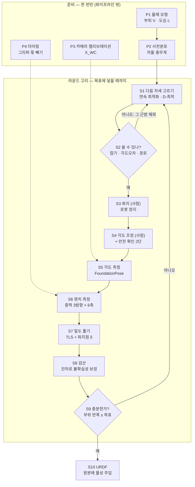
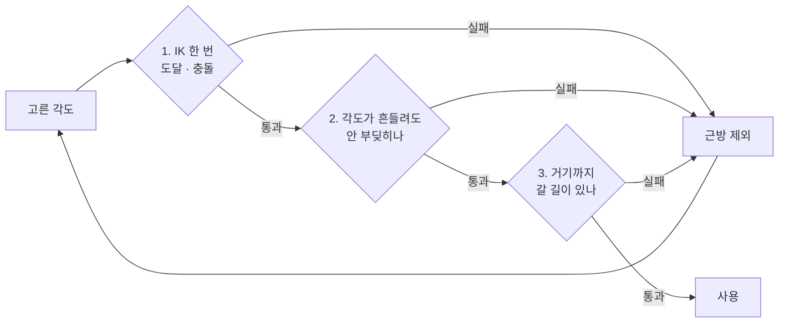
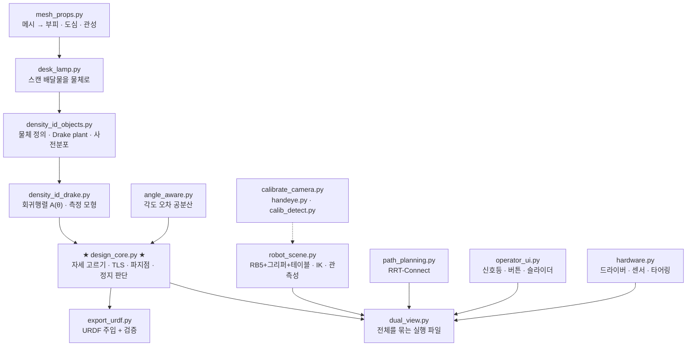

# 파이프라인 — 무엇이 어떤 순서로 일어나는가

이 문서는 **완성된 알고리즘의 지도**입니다. 각 단계가 왜 있어야 하는지,
무엇을 하는지, 어느 파일에 있는지, 그리고 **빼먹으면 무슨 일이 나는지**를
적었습니다.

> 처음 읽는 분은 [ALGORITHM.md](ALGORITHM.md) 를 먼저 보세요. 그쪽은 "왜 이게
> 어려운 문제인가" 를 수식 하나로 설명합니다. 이 문서는 그 다음, "그래서
> 시스템이 어떻게 생겼나" 입니다.
> 실행 절차와 검증 방법은 [VERIFICATION.md](VERIFICATION.md).

---

## 0. 한 장으로



고리가 두 개입니다.

- **안쪽 고리** `S1 → S2 → S1` : 쓸 수 있는 자세가 나올 때까지 다시 고르기.
  로봇을 안 움직이고 계산만 합니다.
- **바깥 고리** `S1 → … → S9 → S1` : 충분히 확실해질 때까지 측정 반복.
  한 바퀴에 1~2분, 보통 1~2바퀴면 끝납니다.

`P3`, `P4` 가 점선인 것은 **매 라운드가 아니라 세션 시작에 한 번** 하고,
그 결과를 `S5`, `S6` 이 갖다 쓰기 때문입니다.

---

## 1. 준비 — 파이프라인이 돌기 전에 끝나 있어야 하는 것

여기 넷은 **알고리즘 밖**입니다. 그런데 이걸 안 하면 알고리즘이 아무리
정확해도 답이 틀립니다. 전부 **라운드를 늘려도 안 없어지는 치우침**을
만들기 때문입니다.

### P1. 물체 모형 — 부피와 도심

**무엇을 하나.** 물체를 부위로 나누고, 부위마다 부피 `V` 와 도심 `c` 를 구합니다.

| 출발점 | 물체 | 어떻게 |
| --- | --- | --- |
| CAD 치수 | 3-link, 2-link | 직육면체라 숫자 몇 개 (`density_id_objects.py`) |
| 스캔 메시 | 데스크 램프 | 닫힌 메시에서 적분 (`mesh_props.py`, `desk_lamp.py`) |

**왜 필요한가.** 회귀행렬 `A(θ)` 가 **부피와 도심으로만** 만들어집니다.

```
y = A(θ) ρ + ε        A 는 V 와 c 로만 짜인다 → 밀도를 몰라도 만들 수 있다
```

이것이 이 연구가 성립하는 이유입니다. 정답(밀도)을 모르는 채로 계수표를
만들 수 있어야 미지수를 풀 수 있습니다.

**주의 — 스캔 부피는 재료 부피가 아닙니다.**

```
베이스   스캔 166.8   실측 290.2 cm³   ← 바닥이 테이블에 닿아 안 찍힘
Arm      스캔 219.1   실측  72.9 cm³   ← 가는 관을 겉면으로만 떠서 부풀음
Head     스캔 441.8   실측  52.8 cm³   ← 갓이 속이 빔
```

**이건 문제가 안 됩니다.** 알고리즘은 `ρ × V` 가 렌치를 설명하도록 `ρ` 를
맞추므로, `V` 가 2배면 `ρ` 가 절반으로 나오고 **곱인 질량은 그대로**입니다.
시뮬레이터에 필요한 것은 질량이지 밀도가 아닙니다.

**도심은 사정이 다릅니다.** 속 빈 갓은 겉모양 도심과 재료 도심이 다르고,
그 차이는 치우침이 됩니다. **5 mm 어긋나면 질량 42 % 오차.**
`--com-error` 로 얼마나 아픈지 재볼 수 있습니다.

> 힌지도 여기서 부위로 셉니다. 41 g 짜리를 빼먹으면 3-link 는 19.4 %,
> 2-link 는 2.6 % 틀리는데 **알고리즘은 그걸 모릅니다** (`study_hinge.py`).

### P2. 사전분포 — 저울에 올린 셈 치고 출발

**무엇을 하나.** 물체 전체를 저울에 올려 총무게만 아는 상태에서 시작합니다.

**왜 필요한가.** 불확실성이 어떻게 생겼는지 보면 압니다. 부위 3개면 밀도는
3차원 공간의 점이고, 불확실성은 그 점을 감싼 럭비공입니다.

```
방향 1   폭 196.0 %   ← 완전히 모름 (부위끼리 어떻게 나눠 갖는지)
방향 2   폭 196.0 %   ← 완전히 모름
방향 3   폭   0.4 %   ← 저울이 채워준 것 (총합)
```

**저울은 "합" 하나만 알려줍니다.** 그 합을 셋이 어떻게 나눠 갖는지는 전혀
모릅니다. 그래서 측정이 남은 방향을 하나씩 메웁니다.

**라운드 수는 "저울로 안 채워진 방향이 몇 개인가" 로 정해집니다.**

| | 자유로운 미지수 | 저울이 채우는 것 | 남는 방향 | 실제 라운드 |
| --- | ---: | ---: | ---: | ---: |
| 램프 | 부위 3 | 1 (총합) | 2 | **2** |
| 3-link | 부위 3 | 1 (총합) | 2 | **2** |
| 2-link | 부위 2 | 1 (총합) | 1 | **1** |

힌지는 미지수 벡터에 같이 들어가지만 저울로 이미 재서 사전분포가 좁으므로
남는 방향을 늘리지 않습니다. 그래서 3-link 는 미지수가 5개(부위 3 + 힌지 2)
여도 램프와 같은 2 라운드입니다.

총질량은 나중에 **파지점 어긋남을 푸는 데도** 쓰입니다 (S7).

### P3. 카메라 캘리브레이션 — X_WC

**무엇을 하나.** 로봇 베이스 기준 카메라 자세를 구해 파일로 남깁니다.
보정판을 그리퍼에 볼트로 붙이고 로봇이 자세 20개를 순회하면 자동으로 풉니다.

```
매 자세에서   X_WC · X_CT = X_WE · X_ET
자세 둘을 빼면   A X = X B      ← 같은 운동을 두 좌표계에서 본 것
```

**왜 필요한가.** 각도를 읽는 자세는 **카메라가 어디서 보느냐**로 정해집니다
(S5). 명목 위치로 계산해 두고 실제 카메라가 10 cm 옆에 있으면, 애써 고른
자세가 최적이 아니고 심하면 물체가 화면 밖으로 나갑니다. 카메라는 팔이
부딪힐 수 있는 **장애물**이기도 해서 충돌 판정도 함께 어긋납니다.

자세 20개면 0.43 mm 까지 갑니다. 자세하게는 [calibration/README.md](../calibration/README.md).

### P4. 타어링 — 그리퍼 몫 빼기

**무엇을 하나.** 물체를 **잡지 않은** 상태로 탐색에 쓸 자세를 밟으며 렌치를
재둡니다. 그 값이 그리퍼가 만드는 몫입니다.

```
센서가 읽는 값 = 물체 + 그리퍼 + 센서 마운트 + 손가락
y_물체(g)     = y_측정(g) − y_공회전(g)
```

**왜 필요한가.** 모형의 `y` 는 **물체만** 만드는 렌치입니다. 그런데
Robotiq 2F-85 만 해도 0.4 kg 이 넘고 **램프 전체가 0.56 kg** 입니다.
안 빼면 신호가 그리퍼 무게에 묻힙니다.

**중력 방향별로 따로** 재야 합니다. 자세마다 그리퍼 무게가 다른 방향으로
실리기 때문입니다. 그리고 타어링과 측정에서 **같은 개구량**을 써야 합니다 —
죠를 열고 닫으면 손가락 위치가 바뀌어 무게중심이 움직입니다.

---

## 2. 라운드 고리

### S1. 다음 자세 고르기 — 연속 최적화 · D-최적

**무엇을 하나.** "지금 아는 밀도가 이 정도라면, 각 각도에서 재면 불확실성
구름이 얼마나 줄어들까" 를 계산해 가장 많이 줄어드는 각도를 찾습니다.

```
정보행렬  M = Σ Aᵀ R⁻¹ A          다음 자세는 이 행렬식을 가장 키우는 각도
```

**왜 필요한가.** 아무 각도나 재면 되는 게 아닙니다. **관절 축이 중력과
나란해지면 그 아래 부위가 만드는 비틀림이 0** 이 되어, 아무리 재도 그 부위
무게가 안 보입니다(문 경첩을 세워 놓은 것과 같습니다).

**설계 선택은 전부 재서 정했습니다.**

| 물음 | 답 | 근거 |
| --- | --- | --- |
| 격자 vs 연속 최적화 | **연속 최적화** — 441칸 격자보다 나은 답을 절반의 계산으로 | `study_continuous.py` |
| D / A / E 중 무엇 | **D-최적** — 부위 수를 늘려도 안정 | `study_criterion.py` |
| 어느 방향으로 기울일까 | 직교 3방향이면 **그 세트를 통째로 회전시켜도 정보량이 같다** | `study_tilt.py` |

> 알아 둘 것: 선형·가우시안 모형에서 정보행렬은 **측정값 y 에 의존하지
> 않습니다.** 그래서 자세 선택은 원리상 데이터를 보기 전에 정해집니다.
> 실제로 라운드마다 답이 달라지는 것은 **추정값에 의존하는 제약**
> (힌지 토크, 파지 가능성) 때문입니다.

### S2. 쓸 수 있는 자세인지 검사 — 세 단계

계산이 "이 각도가 최고" 라고 해도 로봇이 못 잡으면 소용없습니다.



**핵심: IK 는 한 번만 풉니다.** IK 가 거는 제약 셋 중 (a) 중력 방향과
(b) 작업공간은 **센서 프레임만** 보는데, 센서 프레임은 물체 관절각과
무관합니다(팔을 고정한 채 θ 를 흔들어도 변화가 정확히 0 임을 확인).
θ 에 의존하는 것은 **충돌뿐**입니다. 그래서 각도 오차 구간은 충돌 질의만
훑습니다 — 후보당 **3497 ms → 170 ms (21배)**.

**2단계가 왜 필요한가.** 사람이 45° 로 맞춰도 실제로는 44.7° 일 수 있고,
카메라가 45.3° 로 읽을 수도 있습니다. **로봇은 실제 각도를 알 방법이
없습니다.** 명령한 각도 하나만 확인하고 보내면, 카메라가 조금 다르게 읽는
순간 못 잡아서 그 라운드가 통째로 날아갑니다.

훑는 범위는 **두 몫의 합**입니다.

```
1.96 σ          FoundationPose 가 각도를 잘못 읽는 몫
+ ANGLE_TOL     작업자 조정을 통과시키는 창 (±5°)
```

둘째 몫이 왜 들어가나 — 통과 판정은 **읽은 각도**로 하고, 그 판정은 목표에서
±5° 까지 벗어난 각도를 통과시킵니다. 즉 로봇은 목표가 아니라 '통과된 각도'
에서 움직입니다. 거기까지 검사해 두지 않으면 **검사한 적 없는 형상으로
로봇이 이동**합니다. (시뮬레이션은 각도를 정확히 맞춰 줘서 이 구멍이 안 보입니다)

**3단계가 왜 필요한가.** "그 자세로 서 있을 수 있나" 와 "거기까지 갈 수
있나" 는 **다른 문제**입니다. 직선 보간으로 이으면 사이를 아무도 확인하지
않는데, 실제로 물체 끝 링크가 테이블을 **62 mm 관통**하는 구간이 나왔습니다.
RRT-Connect 로 충돌 없는 길을 찾습니다 (`path_planning.py`).

**안전 간격은 10 mm 입니다.** 시뮬레이션이 재는 것은 '모형 사이' 간격인데,
실물에는 모형에 없는 오차가 겹쳐 쌓이기 때문입니다 — 손-눈 잔차 2~3 mm,
자세 오차 2~3 mm, 파지점 어긋남 ~5 mm, 스캔 형상 오차 1~2 mm.

| | 후보 자세 | 경로 위 실제 최소 간격 |
| --- | --- | --- |
| 3-link | 23/25 | 10.89 mm |
| 2-link | 4/5 | — |
| 램프 | 19/25 | 10.04 mm |

### S3. 파지 — 사람이 물체를 물린다

**무엇을 하나.** 로봇을 세우고 서보를 끈 뒤, 작업자가 물체를 죠 사이에 넣고
물립니다. 확인 버튼을 누르면 서보를 켜고 **팔 자세를 다시 읽습니다.**

**왜 이 순서인가.** 파지가 이동보다 **먼저**여야 합니다.

- 경로계획의 충돌 모형은 '물체를 든 팔' 입니다. 빈 손으로 먼저 움직이면
  계획과 실제가 다르고, 물체를 든 뒤 그 자세가 여유를 지킨다는 보장도 없습니다.
- 작업자가 로봇 옆에 있는 동안 로봇이 움직이면 안 됩니다.

**팔 자세를 가정하면 안 됩니다.** 예전에는 시작 자세에 있다고 가정했는데,
실물은 전원을 켠 자리에 서 있습니다. 그러면 RRT 가 `start_q → start_q` 를
풀어 경유점 하나를 내놓고, 드라이버가 팔을 **계획에 없는 직선으로** 보냅니다.
서보가 꺼진 동안 중력으로 처지기도 하므로 켠 뒤에 **다시 읽습니다.**

### S4. 각도 조정 — 사람이 맞추고, 두 번 확인

**무엇을 하나.** 작업자가 슬라이더로 물체 관절각을 맞추고, 버튼 두 개를
누릅니다. ① 조정 완료 → ② 손을 뗐습니다.

**왜 버튼이 둘인가.** "각도가 맞았다" 와 "사람이 물러났다" 는 다른 사실이고,
로봇을 움직여도 되는 조건은 **둘째**입니다.

**허용 오차 ±5°.** 이 값은 작업자 손재주가 아니라 **각도를 읽는 쪽의
정확도**로 정해집니다 — 판정을 FoundationPose 가 읽은 각도로 하기 때문입니다.
이 창이 FoundationPose 자체 오차보다 좁으면 작업자가 아무리 잘 맞춰도
통과할 수 없고 **라운드가 무한히 반복됩니다.**

코드에 박힌 안전 규칙 셋:
1. 시작 자세에서 로봇은 절대 안 움직인다 (사람이 손대는 동안 정지)
2. 버튼 두 개를 눌러야 이동이 시작된다
3. 준정적으로 움직인다. 두 가지를 따로 본다 —
   이동 시간이 관성 토크를 중력 토크의 **1 % 미만**으로 누르는가
   (`dual_view.inertial_share`), 그리고 관성 반력이 힌지 정지토크의
   **25 %** 를 안 넘는가 (`robot_scene.quasi_static_duration`)

### S5. 각도 측정 — FoundationPose

**무엇을 하나.** 카메라로 물체의 실제 관절각을 읽습니다. 관절마다 **그 각도가
가장 잘 보이는 자세**로 물체를 들어 올려 읽습니다.

**왜 자세를 골라 읽나.** 각도 관측성 `px/deg` — 관절을 1° 돌렸을 때 움직이는
부위가 화면에서 몇 화소 움직이는가입니다.

```
축 a 둘레로 도는 점 p 의 속도   v = a × (p − o)
화면에 보이는 것은 시선에 수직인 성분뿐
```

**축이 시선과 직각이면 회전이 깊이 방향으로 나가 거의 안 보입니다** —
재보니 최악 자세가 최선 대비 **2.8~6.8배** 나빴습니다 (`study_startpose.py`).
이 값이 작으면 FoundationPose 가 그 각도를 못 읽습니다.

**중요: 측정 각도는 밀도 추정에만 씁니다.** 팔 자세와 경로 계획은
**계획 쪽이 검사한 그 각도**로 합니다. 다시 풀면 다른 해가 나오거나 실패해서
검사와 실행이 어긋납니다 — 실제로 −87.45° 에서 통과한 후보가 −86.90° 에서
실패해 라운드가 통째로 날아갔습니다.

### S6. 렌치 측정 — 중력 3방향 × 6축 = 18개

**무엇을 하나.** 로봇이 손목을 돌려 물체를 서로 직각인 세 방향으로 기울이고,
**그 자리에서** 힘/토크를 읽습니다. 타어링 값을 뺍니다.

```
     ↓ 아래로            → 옆으로            ↗ 앞으로
   숫자 6개             숫자 6개             숫자 6개
```

**왜 3방향인가.** 공간이 3차원이기 때문입니다. 4개, 6개로 늘려도 이득이 거의
안 늡니다. 그리고 **직교 3방향인 한 그 세트를 통째로 어떻게 회전시켜도 얻는
정보량이 정확히 같습니다** — 하나가 안 보이는 방향에 빠지면 나머지 둘이 그만큼
잘 보이는 자리로 옮겨가기 때문입니다 (`study_tilt.py`).

**한 자세로 다 돌고 나서 한꺼번에 읽으면 안 됩니다.** 실물 센서는 지금 손목에
걸린 것만 읽으므로, 중력 방향마다 **그 자리에서** 재야 합니다.

### S7. 밀도 풀기 — TLS + 파지점 δ

여기가 이 연구에서 가장 중요한 부분입니다. 연립방정식을 푸는 건데,
**계수표 `A(θ)` 자체가 조금 틀려 있습니다.**

#### 왜 보통 최소제곱으로는 안 되나 — 영수증 비유

> `총액 = 개수 × 단가` 에서 단가를 구하려는데 **개수를 세는 사람이 가끔 틀립니다.**

**WLS** 는 개수가 맞다고 치고 틀린 몫을 "총액 쪽 오차" 로 떠넘깁니다.
그러면 단가가 한쪽으로 **치우칩니다.**

**TLS** 는 개수도 미지수로 놓고 단가와 **같이** 풉니다.

```
min over ρ, {δᵢ}
    Σᵢ ‖ yᵢ − A(θᵢ + δᵢ) ρ ‖²_{R⁻¹}     측정이 맞아야 하고
  + Σᵢ ‖ δᵢ ‖²_{Σθ⁻¹}                    각도 보정은 작아야 하고
  + ‖ ρ − μ₀ ‖²_{Σ₀⁻¹}                   사전분포에서 멀지 않아야 한다
```

**왜 치우침이 무서운가.** 흔들림은 여러 번 재서 평균내면 사라지지만,
치우침은 **아무리 많이 재도 안 사라집니다.**

```
측정 횟수    WLS 치우침    TLS 치우침
    2회        0.59 %        0.01 %
    8회        1.41 %        0.01 %   ← WLS 는 8번을 재도 그대로
```

**WLS 는 2회(0.59 %)보다 8회(1.41 %)가 더 나쁩니다.** 더 많이 잰다고 좋아지지
않습니다. 그래서 계산 방법 자체를 바꿔야 했습니다 (`study_tls.py`).

#### 파지점 어긋남도 함께 푼다

시뮬레이션에서는 "센서 원점이 물체의 이 점에 있다" 고 정확히 줄 수 있지만
실물에서는 못 줍니다. 지그를 대도 몇 mm 는 어긋나고, 그 어긋남 δ 는
**모든 부위의 모멘트팔을 똑같이 밀어 놓습니다.** — **2 mm 에 113 % 오차.**

그런데 이 몫은 **모형 안에 넣을 수 있습니다.**

```
τ_true = Σ mᵢ (cᵢ − δ) × g = τ_model + M·G·[g]ₓ δ
```

총질량 `M` 은 저울로 이미 아니까(P2), **δ 는 선형 미지수 3개**로 들어옵니다.
힘 성분에는 안 나타납니다(`F = Mg` 는 어디서 재든 같습니다). 중력 방향 하나는
`g` 에 수직인 2차원만 잡지만, **직교 3방향을 다 쓰면 3차원이 다 잡힙니다.**

> 각도 오차 δᵢ 와 파지점 δ 는 **서로 다른 것을 고칩니다.** 각도는 라운드마다
> 다르고, 파지점은 모든 라운드에 똑같이 실립니다. 한쪽만 고치면 다른 쪽
> 치우침이 그대로 남습니다.

### S8. 검산 — 잔차로 불확실성 보정

**무엇을 하나.** 예측한 손목 값과 실제로 읽은 값의 차이(잔차)를 봅니다.

```
백색화 잔차 제곱합 / 자유도 = 1 이어야 한다
5 가 나오면 "내 잡음 모형이 √5 배 낙관적이었다" → 그만큼 폭을 넓힌다
```

**왜 필요한가.** 알고리즘이 "다 맞췄다" 고 말하는데 실제로는 틀린 상황을
잡아내야 합니다. **정답을 몰라도 계산됩니다** — 예측값과 측정값은 둘 다
손에 있으니까요.

효과 ("95 % 확률로 이 범위" 라고 했을 때 실제로 들어온 비율, 150회 채점):

```
                검산 안 함    검산 함
   WLS             3 %          3 %      ← 못 고침
   TLS            88 %         99 %      ← 제자리를 찾음
```

**WLS 는 정지 조건만 손봐서는 못 구합니다.** 오차가 흔들림이 아니라 치우침이라,
범위를 넓혀도 "언제 멈춰도 틀린" 상태가 "틀렸다고 인정하는" 상태로 바뀔 뿐입니다.

> 함정 하나: 파지점 어긋남을 함께 풀 때는 그 몫을 **예측값에 더해서** 잔차를
> 재야 합니다. 안 넣으면 어긋남이 통째로 잔차로 잡혀 팽창이 **×105** 까지
> 뛰고, 정지 조건이 영영 만족되지 않습니다 (실제로 그랬습니다).

### S9. 정지 판단

**무엇을 하나.** 95 % 상대 반폭이 목표(기본 1 %) 이하면 멈춥니다.

```
반폭 = 1.96 · √(대각(Σ)·팽창² + 치우침몫) / |ρ̂|
```

**정답은 안 씁니다.** 실물에서는 모르기 때문입니다. 이건 이 저장소의
가장 중요한 규칙입니다 — GT 가 쓰이는 곳은 마지막 채점뿐이어야 합니다.

**부위만 봅니다.** 힌지처럼 이미 저울로 재서 아는 양은 `ρ` 벡터에 같이
들어가지만 탐색의 목적이 아닙니다. 그런 성가신 매개변수까지 최댓값에 넣으면
이런 일이 납니다.

```
부위 반폭 [0.074, 0.639, 0.361] %   ← 이미 목표 1 % 달성
힌지 반폭 [3.712, 3.712] %          ← 사전분포 폭 그대로, 안 줄어듦
전체 최대 3.712 %                   → 목표 미달로 판정, 루프가 안 끝남
```

### S10. URDF — 원본에 물성만 주입

**무엇을 하나.** 확정된 밀도로 부위마다 질량·무게중심·관성텐서를 만들어,
**배달물 원본 URDF 의 `<inertial>` 만** 갈아끼웁니다.

```
outputs/estimated_desklamp.urdf
  = assets/desk_lamp_minimal_sim/drake/object.urdf 그대로
  + 링크 3개의 질량 · 무게중심 · 관성텐서만 교체
  + 메시 경로를 산출물 기준 상대경로로 재작성
```

**왜 새로 지으면 안 되나.** 예전에는 새 물체를 지었는데, 그러면 스캔 메시가
AABB 상자로 퇴화하고, 파지 부위를 뿌리로 다시 세운 트리가 나가고, 배달물의
볼록분해 21조각이 통째로 버려졌습니다. **램프 Arm 은 AABB 가 실제 재료의
3배**라 시뮬레이터에서 굵기가 3배인 팔이 됩니다.

배달물의 `<inertial>` 은 원래 **밀도 1000 kg/m³ 자리표시자**였습니다
(link_1: 441.02 cm³ → 0.4410195 kg). 그러니 할 일은 새로 짓는 게 아니라
그 자리표시자를 추정값으로 바꾸는 것이었습니다.

관성텐서는 **메시에서 뽑은 것**을 씁니다. 상자 공식은 관성적(慣性積)을 0 으로
놓는데, 굽은 팔은 링크 축에 정렬돼 있지 않아 실제로 0 이 아닙니다.

만든 뒤 Drake 로 **되읽어 검증**합니다 (오차 1e-10).

---

## 3. 단계를 빼먹으면 무슨 일이 나나

한눈에 보는 표입니다. 굵은 것은 **라운드를 늘려도 안 없어지는 치우침**입니다.

| 빼먹은 것 | 증상 | 크기 |
| --- | --- | --- |
| P1 힌지를 부위로 안 셈 | 알고리즘은 맞췄다고 믿음 | **3-link 19.4 %, 2-link 2.6 %** |
| P1 도심이 틀림 | 〃 | **5 mm 에 42 %** |
| P3 캘리브레이션 | 각도 측정 자세가 최적이 아님, 충돌 판정 어긋남 | 위치 오차만큼 |
| P4 타어링 | 신호가 그리퍼 무게에 묻힘 | **그리퍼 0.4 kg vs 램프 0.56 kg** |
| S2-2 각도 오차 구간 검사 | 라운드가 통째로 날아감 | 0.55° 차이로 실패한 사례 |
| S2-3 경로 검사 | 이동 중 테이블 관통 | **62 mm** |
| S7 TLS (WLS 로 대신) | 더 재도 안 좋아짐 | **8회에 1.41 %** |
| S7 파지점 δ | 모든 모멘트팔이 밀림 | **2 mm 에 113 %** |
| S8 검산 | 틀린 답을 맞다고 믿음 | 적용률 88 % → 99 % |
| S8 파지점 몫을 잔차에서 뺌 | 정지 조건이 영영 안 만족 | 팽창 **×105** |
| S9 힌지를 정지 판단에 포함 | 부위가 수렴해도 안 끝남 | 3.7 % 에서 멈춤 |
| S10 원본 대신 새로 지음 | 시뮬에서 팔 굵기 3배 | AABB vs 재료 |

---

## 4. 코드 지도



| 단계 | 파일 | 함수 |
| --- | --- | --- |
| P1 | `density_id_objects.py`, `mesh_props.py`, `desk_lamp.py` | `build_spec`, `mass_properties` |
| P2 | `density_id_objects.py` | `apply_weight_prior`, `apply_mesh_prior` |
| P3 | `calibrate_camera.py`, `handeye.py`, `calib_detect.py` | `run`, `solve_eye_to_hand` |
| P4 | `hardware.py` | `run_tare`, `TareTable` |
| S1 | `design_core.py` | `continuous_best`, `utility` |
| S2 | `dual_view.py`, `robot_scene.py`, `path_planning.py` | `check_candidate`, `angle_probes`, `PoseChecker`, `ArmPathPlanner` |
| S3 | `dual_view.py` | `await_grasp`, `sync_from_robot` |
| S4 | `dual_view.py`, `operator_ui.py` | `adjust_manually`, `Console` |
| S5 | `dual_view.py`, `robot_scene.py` | `measure_angles`, `observability_px_per_deg`, `find_viewing_poses` |
| S6 | `dual_view.py`, `hardware.py` | `read_one`, `WrenchSensor` |
| S7 | `design_core.py` | `tls_map`, `grasp_columns` |
| S8 | `design_core.py` | `residual_inflation`, `bias_by_refit` |
| S9 | `design_core.py` | `half_width`, `stopping_width` |
| S10 | `export_urdf.py` | `export`, `inject_into_source` |

전 과정을 인자 하나로 바꿔 가며 돌리는 **유일한 루프**는
`design_core.closed_loop` 입니다. 화면으로 볼 때는 `dual_view` 가 같은 조각을
화면 갱신과 섞어 쓰지만 **알고리즘은 한 벌뿐입니다.**

---

## 5. 지금까지의 결과

**데스크 램프** (실물 스캔, 분해해서 저울로 잰 값 대비)

| 부위 | 실측 질량 | 추정 오차 |
| --- | ---: | ---: |
| 베이스 | 396.0 g | 0.01 % |
| 연결부(Arm) | 82.0 g | 0.21 % |
| Head | 84.0 g | 0.03 % |

**커스텀 CAD 물체** — 둘 다 같은 힌지(41 g)를 부위로 셉니다.

| | 부위 오차 | 힌지 오차 | 라운드 | 후보 |
| --- | ---: | ---: | ---: | ---: |
| 3-link | 0.01~0.04 % | 0.03 % | 2 | 23/25 |
| 2-link | 0.03~0.07 % | 0.09 % | 1 | 4/5 |

한 라운드에 1~2분, 전체 3~4분입니다.

### 한계

**부위 4개까지가 현실적입니다.**

```
부위 3개 :  2회 측정,  오차 0.1 %      ← 지금 물체
부위 4개 :  3.5회,     오차 0.25 %
부위 5개 : 10.5회,     오차 0.5 %      ← 아슬아슬
부위 6개 : 12회에도 못 끝남, 오차 5 %
```

부위가 늘면 미지수는 느는데 손목 센서가 주는 숫자는 그대로 18개입니다.
게다가 끝쪽 부위는 가볍고 손목에서 멀어서 무게가 달라져도 센서 값이 거의
안 변합니다. **계산 방법을 바꿔서 해결될 문제가 아니고, 카메라 각도
정밀도(현재 ±5 %)를 올려야 합니다.**

**다루는 물체의 조건**: 사람이 각도를 맞춰 두면 **그대로 고정되는** 물건만
다룹니다(노트북, 스탠드 램프, 폴더블 폰). 각도가 흐르면 계수표가 틀려집니다.

**아직 시뮬레이션으로 확인 못 한 것**: 스캔 부피 ≠ 재료 부피, 도심 오차,
파지 반복도, 타어링 정확도. 전부 "모형이 실물과 다른" 문제이고
**치우침**입니다. 자세히는 [VERIFICATION.md 3장](VERIFICATION.md).
