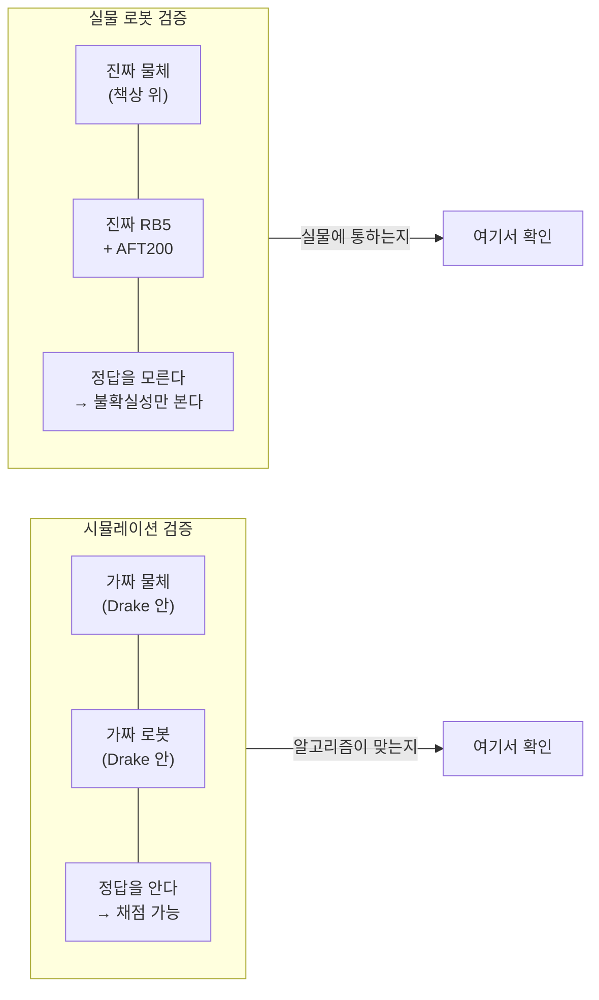
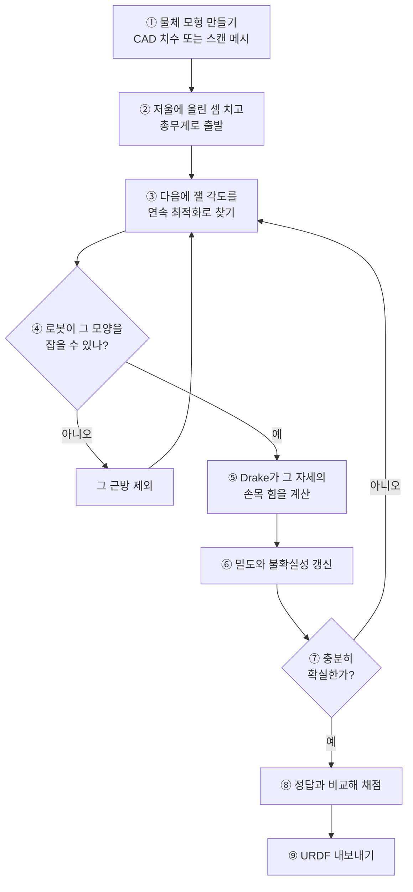
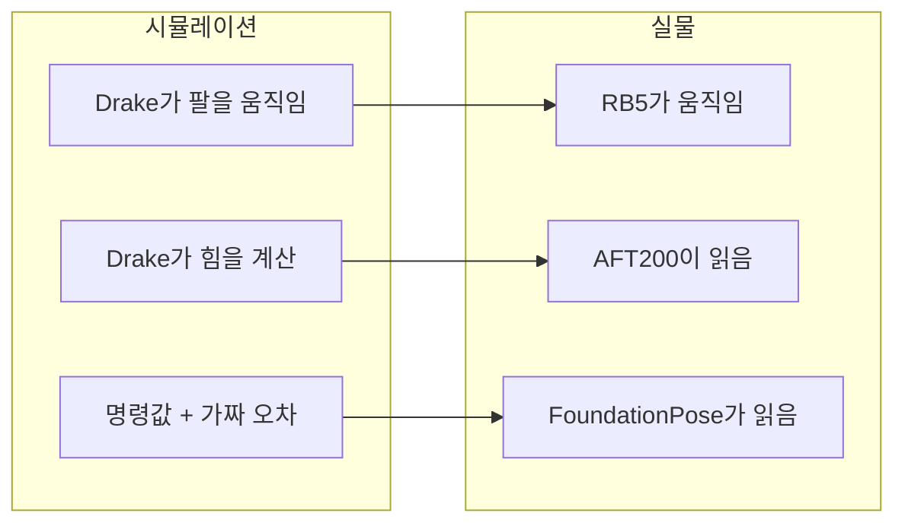
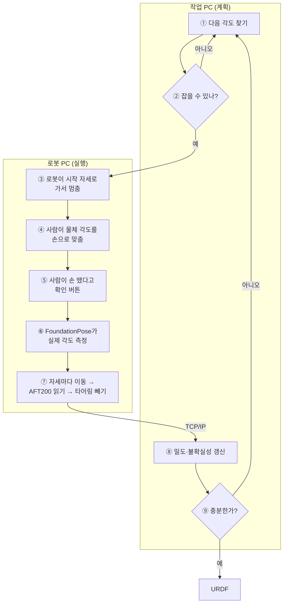

# 검증하는 두 가지 길 — 시뮬레이션과 실물 로봇

이 파이프라인은 **같은 알고리즘을 두 가지 방식으로** 돌릴 수 있습니다.
무엇이 같고 무엇이 다른지, 각 단계에서 사람이 무엇을 해야 하는지 정리했습니다.

수식은 쓰지 않습니다. 알고리즘 자체가 궁금하시면 [ALGORITHM.md](ALGORITHM.md)를
먼저 보세요.

---

## 0. 두 길을 한눈에



**둘 다 필요합니다.** 시뮬레이션은 "계산이 맞나"를, 실물은 "세상에 통하나"를
확인합니다. 시뮬레이션에서 잘 되는데 실물에서 틀리는 원인은 대부분
**모형이 빠뜨린 것**입니다 — 힌지 무게, 그리퍼 무게, 파지 위치 같은 것들.

| | 시뮬레이션 | 실물 로봇 |
| --- | --- | --- |
| 물체 | Drake 안의 모형 | 책상 위 진짜 물건 |
| 로봇 움직임 | Drake 애니메이션 | 진짜 RB5 |
| 손목 힘 | 계산으로 만듦 | AFT200이 읽음 |
| 관절 각도 | 명령값 + 가짜 오차 | FoundationPose가 읽음 |
| 정답(GT) | **안다** — 채점에 씀 | **모른다** |
| 화면 | 2개 (계획 + 로봇/UI) | 2개 (계획 + UI) |
| 한 라운드 | 30초~2분 | 1~2분 |
| 실패해도 | 다시 돌리면 됨 | 사람이 다시 맞춰야 함 |

---

## 1. 시뮬레이션 검증

### 파이프라인



### 각 단계에서 하는 일

**① 물체 모형 만들기**

두 가지 출발점이 있습니다.

- **CAD 치수** — 3-link, 2-link. 직육육면체라 숫자 몇 개면 끝납니다.
- **스캔 메시** — 데스크 램프. 실물을 3D 스캔해서 받은 메시를 씁니다.

스캔 메시는 **닫혀 있어야** 합니다. 구멍이 뚫려 있으면 부피와 무게중심이
틀립니다. 코드가 자동으로 확인하고, 열려 있으면 볼록 조각들의 합집합으로
우회합니다.

**② 저울에 올린 셈 치고 출발**

물건 전체를 저울에 올려 총무게만 아는 상태에서 시작합니다. 부위별로 어떻게
나뉘는지는 전혀 모릅니다 — 그게 바로 알아내려는 것입니다.

**③ 다음에 잴 각도 찾기**

지금 아는 밀도로 "각 각도에서 재면 불확실성이 얼마나 줄어들까"를 계산해
가장 많이 줄어드는 각도를 고릅니다.

**④ 로봇이 잡을 수 있나 검사** ← 여기가 자주 막힙니다

세 가지를 봅니다.

```
1. 그 모양의 물체를 잡고 세 방향으로 세울 수 있나  (IK)
2. 카메라가 각도를 조금 잘못 읽어도 여전히 되나    (오차 구간 격자)
3. 시작 자세에서 거기까지 갈 길이 있나             (경로 계획)
```

막히면 그 근방을 빼고 다시 찾습니다. 12번까지 시도하고, 그래도 안 되면
미리 검증해 둔 격자 후보로 물러납니다.

**⑤ 손목 힘 계산**

Drake가 물체의 총질량과 무게중심에서 정확한 힘·토크를 계산하고, 거기에
센서 잡음을 섞습니다. 실물의 AFT200을 흉내내는 것입니다.

**⑥~⑦ 갱신과 정지 판단**

이 부분은 실물과 **완전히 같은 코드**입니다. 정답을 안 봅니다.

**⑧ 채점** ← 시뮬레이션에만 있는 단계

여기서만 정답을 씁니다. "추정 5200.7 / 정답 5200 / 오차 0.01%" 처럼 찍힙니다.

**⑨ URDF 내보내기**

추정한 밀도로 질량·무게중심·관성모멘트를 계산해 시뮬레이터가 읽는 파일을
만들고, Drake로 되읽어 검증합니다.

### 실행

```bash
cd ~/Desktop/HTD-main/my_work
R=../robot_learning/scripts/run_drake_env.sh

# 데스크 램프 (스캔 메시)
$R python dual_view.py --mode sim --object desklamp \
    --angle-error 0 --angle-floor-deg 2 --move-duration 8

# 커스텀 물체 (CAD 치수)
$R python dual_view.py --mode sim --object 3link \
    --joint-range-deg 0 180 --move-duration 8
```

화면 두 개가 열립니다.

```
[1] 계획·탐색 화면   localhost:7000    물체만. 후보를 훑고 각도를 고름
[2] 로봇 + UI 화면   localhost:7001    로봇이 움직임 + 조작 패널
```

`[2]` 의 우측 패널에서 조작합니다.

```
[두 화면을 모두 연 뒤 눌러 시작]
        ↓
슬라이더로 목표 각도에 맞춤
        ↓
[① 조정 완료 — 각도 확인]
        ↓
[② 물체에서 손을 뗐습니다 — 이동 시작]
```

조작 없이 자동으로 보려면 `--auto-adjust --autostart` 를 붙이세요.

### 로봇 없이 물체만 보기

```bash
$R python lamp_view.py            # 램프, 실제 스캔 메시로
$R python desk_lamp.py            # 숫자만, 5초
$R python export_urdf.py --object 3link    # 숫자 + URDF, 20초
```

---

## 2. 실물 로봇 검증

### 무엇이 달라지나

시뮬레이션에서 **Drake가 대신하던 세 가지**가 진짜로 바뀝니다.



**알고리즘 코드는 한 줄도 안 바뀝니다.** 이 셋만 갈아끼웁니다.

### 파이프라인



### 시작하기 전에 반드시 해야 할 네 가지

이걸 안 하면 **알고리즘이 아무리 정확해도 답이 틀립니다.**

**① 타어링 (가장 중요)**

모형이 계산하는 힘은 **물체만** 만드는 힘입니다. 그런데 센서는 이것까지
다 읽습니다.

```
센서가 읽는 값 = 물체 + 그리퍼 + 센서 마운트 + 손가락
```

Robotiq 2F-85만 해도 0.4 kg가 넘습니다. 램프 전체가 0.56 kg인데 말이죠.
**반드시 빼야 합니다.**

> **하는 법**: 물체를 잡지 **않은** 상태로, 탐색에 쓸 것과 똑같은 세 자세를
> 밟으며 힘을 재둡니다. 그 값이 그리퍼가 만드는 몫입니다. 이후 매 측정에서
> 같은 자세의 값을 뺍니다.

자세마다 그리퍼 무게가 다른 방향으로 실리므로 **방향별로 따로** 재야 합니다.
그리고 손가락 개구량이 바뀌면 무게중심도 바뀌니 **같은 개구량**으로 재세요.

센서에 온도 드리프트가 있으므로 **30분마다 다시** 재는 것이 안전합니다.

**② 파지 위치 고정**

모형은 "센서 원점이 물체의 정해진 한 점에 있다"고 가정합니다. 물체가
그리퍼 안에서 **1 mm만 밀려도** 모든 모멘트팔이 틀어집니다.

> **하는 법**: 지그나 스토퍼로 파지 위치를 고정합니다. 한 번 잡으면 실험이
> 끝날 때까지 놓지 마세요.

**③ 좌표 보정 세 가지**

| 무엇 | 왜 |
| --- | --- |
| 손-눈 보정 (카메라 ↔ 로봇) | 카메라가 읽은 각도를 로봇 좌표로 옮기려면 |
| 센서 프레임 ↔ 툴 플랜지 | AFT200이 어느 방향을 읽는지 |
| 중력 방향 확인 | 책상이 0.5° 기울면 중력 방향에 그만큼 오차 |

세 번째가 의외로 큽니다.

**④ 빠뜨린 무게 확인**

저울 하나로 검산됩니다.

```
실측 총무게 − Σ(밀도 × CAD 부피) = 모형이 빠뜨린 질량
```

나사, 인서트 너트, 접착제, 전선이 여기 잡힙니다. 힌지 41 g을 빠뜨렸을 때
어떤 부위 밀도가 29% 틀렸던 적이 있습니다.

### 각 단계에서 하는 일

**① 다음 각도 찾기** — 시뮬레이션과 같습니다.

**② 잡을 수 있나 검사** — 시뮬레이션과 같습니다. Drake 로봇 모형이
**실물 배포에서도 그대로 돕니다.** 화면에 안 그릴 뿐입니다. 실물에 보낼
경유점을 만들어야 하기 때문입니다.

**③ 로봇이 시작 자세로 이동**

화면에 초록 신호등과 함께 "로봇이 멈췄습니다. 접근해도 안전합니다"가 뜹니다.
**이때만 접근하세요.**

**④ 사람이 각도를 맞춤**

화면이 목표 각도를 알려줍니다. 슬라이더는 시뮬레이션용이고, 실물에서는
손으로 물체 관절을 맞추면 됩니다.

**⑤ 안전 확인 버튼**

```
[① 조정 완료 — 각도 확인]        목표와 3도 이상 다르면 다시 요청
[② 물체에서 손을 뗐습니다]        이걸 누르기 전까지 로봇은 안 움직임
```

**⑥ FoundationPose가 실제 각도 측정**

여기가 중요합니다. **사람이 45도로 맞춰도 카메라는 45.3도로 읽습니다.**
로봇은 실제 각도를 알 방법이 없고, 카메라가 준 값이 전부입니다.

코드는 두 값을 엄격히 구분합니다.

```
실제 각도      물리(센서가 읽는 값)를 만드는 것
측정된 각도    로봇이 계산에 쓰는 것
```

**⑦ 자세마다 이동하고 그 자리에서 읽기**

```
중력 아래 방향 자세로 이동 → 멈춤 → 안정 대기 → AFT200 읽기 → 타어링 빼기
중력 옆 방향으로 이동     → 멈춤 → ...
중력 앞 방향으로 이동     → 멈춤 → ...
```

세 자세를 다 돌고 나서 한꺼번에 읽으면 **안 됩니다.** 센서는 지금 손목에
걸린 것만 읽습니다.

로봇은 **천천히** 움직입니다. 빨리 움직이면 가속도 때문에 관성력이 생겨
센서가 중력 말고 다른 것도 읽고, 물체 관절이 흐를 수도 있습니다.

**⑧~⑨ 갱신과 정지 판단** — 시뮬레이션과 같은 코드입니다.

정답을 모르므로 **불확실성만 보고** 멈춥니다. 잔차(예측과 실측의 차이)가
모형보다 크면 그만큼 불확실성을 부풀립니다 — 정답 없이 데이터만으로 계산됩니다.

### 두 PC를 TCP/IP로 잇기

Drake가 있는 파이썬과 로봇 드라이버(ROS1 등)가 있는 파이썬은 보통 다릅니다.
한 프로세스에 억지로 넣으면 환경이 섞여 깨집니다. **나눠 두면 양쪽 다
깨끗하고, 로봇을 다른 PC에 두는 것도 그대로 됩니다.**

```
[작업 PC]  dual_view.py --mode deploy --bus tcp
              화면 [1] 계획·탐색
              포트 5555에서 로봇 쪽 연결을 기다림
                    |
                    |  JSON 한 줄씩
                    v
[로봇 PC]  robot_node.py --host <작업PC> --port 5555
              화면 [2] 작업자 UI
              RB5 + AFT200 + FoundationPose
```

**터미널 1 — 작업 PC**

```bash
$R python dual_view.py --mode deploy --bus tcp --bus-port 5555 \
    --object 3link --joint-range-deg 0 180 \
    --angle-error 0 --angle-floor-deg 2 --max-rounds 8
```

**터미널 2 — 로봇 PC**

```bash
python robot_node.py --host 192.168.0.10 --port 5555 \
    --object 3link --joint-range-deg 0 180 \
    --hardware real --move-duration 8
```

방화벽을 여세요.

```bash
sudo ufw allow 5555/tcp
```

### 주고받는 내용

한 줄에 JSON 하나입니다. 사람이 읽을 수 있어 문제를 찾기 쉽습니다.

```
계획 → 로봇   round, 목표 관절각, **검사 끝난 팔 자세**, 고른 이유
로봇 → 계획   round, 측정된 관절각, **타어링 끝난 힘 18개**, 중단 여부
```

**팔 자세를 계획 쪽이 보내는 게 핵심입니다.** 로봇 쪽은 다시 풀지 않습니다.
검사한 그 자세로 움직이니 검사와 실행이 어긋날 수 없습니다.

### 장비 없이 배선만 확인하기

```bash
# 터미널 1
$R python dual_view.py --mode deploy --bus tcp --bus-port 5555 \
    --object 3link --autostart

# 터미널 2 (25초쯤 뒤)
$R python robot_node.py --host 127.0.0.1 --port 5555 --object 3link \
    --hardware sim --auto-adjust --autostart --move-duration 0.05
```

모의 장비가 **실물 코드가 지나가는 길을 그대로 밟습니다** — 자세마다 읽기,
타어링 빼기까지. 장비가 오기 전에 검증할 수 있습니다.

### 실물 붙이기 — 채워야 할 넷

`--hardware real` 로 돌리면 무엇을 채워야 하는지 알려주고 멈춥니다.
`hardware.py` 의 클래스 설명에 주의사항이 적혀 있습니다.

| | 클래스 | 반드시 지킬 것 |
| --- | --- | --- |
| 1 | `Rb5Driver` | `follow()` 가 **도착할 때까지 막혀야** 함 |
| 2 | `Aft200Sensor` | 1000 Hz, n샘플 평균 |
| 3 | `FoundationPoseSensor` | 손-눈 보정 필요 |
| 4 | `run_tare(...)` | **물체 잡기 전에** 실행 |

1번을 지키지 않으면 위험합니다. `follow()` 가 도착 전에 반환하면 작업자가
움직이는 로봇에 접근할 수 있습니다.

---

## 3. 시뮬레이션으로는 확인할 수 없는 것

시뮬레이션은 **모형이 맞다는 전제** 위에서 돕니다. 그 전제가 틀리면
시뮬레이션은 아무 말도 해주지 않습니다.

| 확인 못 하는 것 | 왜 | 얼마나 아픈가 |
| --- | --- | --- |
| 스캔 부피가 실물과 같은가 | 양쪽 다 같은 부피를 씀 | 질량은 맞음 (밀도가 반대로 보정됨) |
| 스캔 도심이 실물과 같은가 | 〃 | **5 mm 어긋나면 42% 오차** |
| 타어링이 정확한가 | 시뮬레이션엔 그리퍼 무게가 안 섞임 | 큼 |
| 파지가 반복되는가 | 용접으로 모형화 | 1 mm에 모멘트팔 전체가 틀어짐 |
| 빠뜨린 부품이 있는가 | 모형에 없으면 양쪽 다 없음 | 힌지 41 g → 29% 오차 |

**공통점이 있습니다.** 전부 "모형이 실물과 다른" 문제이고, 라운드를 늘려도
안 사라지는 **치우침**입니다. 잔차 검산이 일부는 잡아내지만 전부는 아닙니다.

그래서 순서가 이렇습니다.

```
1. 시뮬레이션으로 알고리즘이 맞는지 확인      ← 계산 오류를 여기서 걸러냄
2. 저울로 빠뜨린 무게 검산
3. 타어링과 파지 지그를 먼저 잡음
4. 실물로 옮김
```

---

## 4. 그리퍼가 후보 자세에 미치는 영향

가지고 계신 그리퍼는 Robotiq 2F-85 하나이므로 기본값입니다. 다만 덩치가
커서 갈 수 있는 자세가 줄어듭니다. 실측한 값입니다.

```
물체       그리퍼         파지단면   개구    최종후보   준비시간
3link      pgc140          44.0mm   53mm     25/25      4.7s
3link      robotiq2f85     44.0mm   78mm     25/25      7.3s
2link      pgc140          40.0mm   53mm       5/5      0.6s
2link      robotiq2f85     40.0mm   78mm       4/5      0.6s
desklamp   pgc140          27.4mm   53mm     24/25     23.8s
desklamp   robotiq2f85     27.4mm   78mm     20/25     52.6s
```

**3-link는 차이가 없고, 램프는 24 → 20개로 줍니다.** 2F-85가 PGC보다 부피가
커서 테이블·팔과 더 자주 부딪히기 때문입니다.

파지 단면은 전부 개구량 안에 들어옵니다. 램프 연결부가 27.4 mm라 둘 다
물리적으로는 잡을 수 있습니다.

> **주의**: 파지 단면은 AABB(바깥 상자)가 아니라 **파지점 근처의 실제 단면**
> 입니다. 램프 연결부는 굽은 팔이라 AABB가 256 mm까지 나오지만 실제로
> 물어야 할 폭은 27.4 mm입니다.

---

## 5. 명령 모음

```bash
cd ~/Desktop/HTD-main/my_work
R=../robot_learning/scripts/run_drake_env.sh
```

| 하려는 것 | 명령 |
| --- | --- |
| 숫자만 빠르게 | `$R python export_urdf.py --object 3link` |
| 램프 숫자만 | `$R python desk_lamp.py` |
| 램프만 3D로 | `$R python lamp_view.py` |
| 시뮬레이션 전체 | `$R python dual_view.py --mode sim --object desklamp` |
| 실물 (계획 쪽) | `$R python dual_view.py --mode deploy --bus tcp --object 3link` |
| 실물 (로봇 쪽) | `python robot_node.py --host <IP> --object 3link --hardware real` |
| 배선만 확인 | 위 두 개에 `--hardware sim` 추가 |
| 그리퍼 실측표 | `$R python grippers.py` |

### 자주 쓰는 옵션

| 옵션 | 뜻 | 추천 |
| --- | --- | --- |
| `--gripper` | `robotiq2f85` / `pgc140` | 기본이 2F-85 |
| `--angle-error` `--angle-floor-deg` | 카메라 각도 오차 | `0` 과 `2` = 고정 2도 |
| `--move-duration` | 이동 하나에 쓰는 시간 | 실물 `8`, 눈으로 볼 때 `12` |
| `--target` | 정지 기준 (반폭) | `0.01` = 1% |
| `--grasp-part` | 램프에서 잡을 부위 | `link_3` (연결부) |
| `--separate-ui` | UI를 따로 띄움 | 화면 3개로 |
