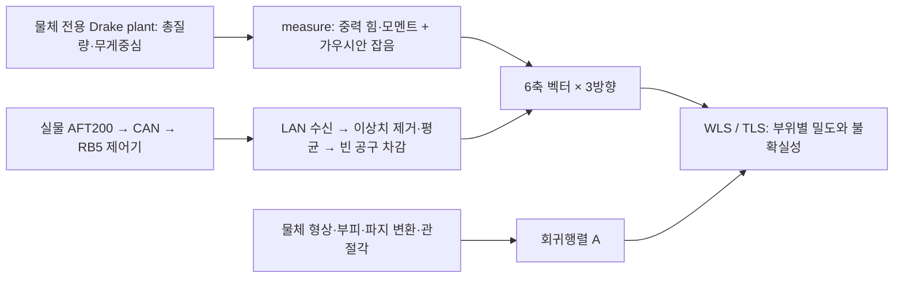

# PIVOT의 가상 F/T 입력과 실물 입력 비교 — 2026-09-07

추가 실험/구현: [정적 공구·물체 분리 검증](FT_PAYLOAD_IDENTIFICATION.md).
현재 실제 교정의 합격을 선언한 문서가 아니다.

## 이번 요청의 네 원인에 대한 판정식

같은 센서 축·원점에서 이상적인 관측은
`w_sim = [m_object·g; h_object × g]`다. 실제 출력에 선형 축간 결합 C가
있다고 가정하면 `w_raw = C(w_tool + w_object) + b(t) + noise`로 쓸 수 있다.
같은 자세·개구·영점에서 빈 상태를 빼도 `Δw_raw = C w_object + Δb + noise`가
남는다. 따라서 **빈 공구 차감은 C를 자동으로 역보정하지 않는다**.
이는 가능한 오차 모형이지 이번 센서에서 C가 원인이라고 확인한 결과는 아니다.

Scalable Real2Sim의 공구/물체 파라미터 차감이 PIVOT의 관측과 일치하려면
센서 축/단위/원점이 맞고, 정지 강체 중력 모형이 유효하며, 하중 중 바이어스와
개구 의존 공구 모형이 유지되고, 센서 출력의 잔여 간섭이 허용범위 이하여야 한다.
지렛대 토크는 이상적인 관측에도 있으므로 지우지 않는다. 제거해야 하는 것은
물체 토크 자체가 아니라 **토크가 다른 출력 축으로 잘못 나타나는 측정 오차**다.

교차축 보정이 필요하더라도 물병 한 자세의 힘·토크 상관으로 6×6 행렬을 맞추지
않는다. 알려진 질량과 독립적으로 알려진 모멘트팔을 여러 방향/하중에서 변화시켜
교정 렌치 행렬의 충분한 rank를 확보하고, 사용하지 않은 하중/자세에서 검증해야
한다. 파지점 10 mm·각도 3°의 가정은 이 교정의 참 토크를 대신하지 않는다.
잔차가 남는다는 이유만으로 제조사 crosstalk 한계에 도달했다고 할 수도 없다.

GitHub `LEE9396/PIVOT` master와 로컬 HEAD는 조사 시점 모두
`20bc9c2358b73d3af78ecae01ae0f210ac997253`이다. 로컬 작업 트리에는 이 커밋 이후의
실험 수정이 있으므로 아래에서 원본과 수정본을 구분한다. 원격 버전은 `git ls-remote`,
원본 함수는 `git show HEAD:파일`로 확인했다. 분석 중 로봇 명령은 보내지 않았다.

핵심: 기본 시뮬레이션은 화면 속 AFT200의 물리적 반력을 읽지 않는다.
물체 전용 Drake plant의 총질량과 무게중심에서 이상적인 정적 6축 렌치를 계산한다.
토크 자체는 포함되지만, 센서 장착부의 변형이나 힘·토크 출력 간 간섭은 포함되지 않는다.



## 1. 시뮬레이션의 센서값 생성

[density_id_drake.py의 measure](https://github.com/LEE9396/PIVOT/blob/20bc9c2358b73d3af78ecae01ae0f210ac997253/my_work/density_id_drake.py#L223)는
`TRUTH_PLANT.SetPositions`로 물체 관절각을 정하고 `CalcTotalMass`,
`CalcCenterOfMassPositionInWorld`로 질량과 도심을 얻는다. 그 뒤 직접 계산한다.

```text
F = FORCE_SIGN * mass * 9.81 * g_hat
T = cross(p_com, F)
y = concatenate(F, T) + Gaussian_noise
```

이 plant의 world는 센서 계산 기준 S이다. 물체를 센서에 고정한 운동학 모형이며,
실험실 world와 동일한 뜻이 아니다. g_hat은 S에서 표현한 중력의 단위 방향이다.
기본 방향은 -Z, +X, +Y이고, 방향마다 6개씩 총 18개 관측값을 쌓는다.

[density_id_objects.bind_object](https://github.com/LEE9396/PIVOT/blob/20bc9c2358b73d3af78ecae01ae0f210ac997253/my_work/density_id_objects.py#L677)는
참 밀도를 가진 truth plant와 단위 밀도를 가진 kinematic plant를 같은 형상·파지
변환으로 만든다. 따라서 잘못된 파지 변환을 양쪽에 똑같이 넣어도 합성 데이터와
추정 행렬끼리는 일치할 수 있다. `shell_com` 같은 불일치 주입 옵션은 있으나
기본 모형이 실제 센서의 내부 역학을 재현한다는 의미는 아니다.

`robot_scene`에는 로봇·센서·그리퍼의 질량과 충돌 형상이 있지만, 해당 장면에서
센서 반력 포트를 읽어 `measure`에 넣는 경로가 아니다. 물체 파지도 강체 용접으로
표현한다. 그리퍼의 접촉·미끄러짐·장착부 탄성 반력을 센서 출력으로 해석하지 않는다.

[원본 simulated_hardware](https://github.com/LEE9396/PIVOT/blob/20bc9c2358b73d3af78ecae01ae0f210ac997253/my_work/dual_view.py#L2165)도
`alg.measure`를 호출하며 빈 공구 영점은 6축 모두 0이다. `n_samples`번 물리 센서를
시뮬레이션해서 평균내는 대신, 평균 후라고 가정한 잡음으로 렌치 하나를 생성한다.
파지 오차를 강제로 넣는 `--grasp-error-mm` 경로도 토크 3개에만 오프셋을 더한다.

## 2. 밀도 행렬의 의미

[regressor](https://github.com/LEE9396/PIVOT/blob/20bc9c2358b73d3af78ecae01ae0f210ac997253/my_work/density_id_drake.py#L206)의
부위 i에 해당하는 열은 다음과 같다. V_i는 부피, c_i는 센서 기준 부위 도심이다.

```text
A_i(theta, g_hat) = 9.81 * V_i * [g_hat ; cross(c_i(theta), g_hat)]
y = A rho + measurement_error
```

밀도 rho_i와 부피 V_i의 곱이 부위 질량이다. 힘 행은 총질량에 관한 정보를 주고,
관절각에 따라 바뀌는 토크 행은 부위별 질량 분배에 관한 정보를 준다. 관측 수가
많아도 부위별 도심 궤적이 구분되지 않으면 식별성이 부족할 수 있다.

[원본 PlannerScreen.update](https://github.com/LEE9396/PIVOT/blob/20bc9c2358b73d3af78ecae01ae0f210ac997253/my_work/dual_view.py#L753)는
수신한 6축 벡터와 측정 관절각으로 행렬을 구성하고 누적 WLS/MAP를 수행한다.
기본 TLS는 밀도와 라운드별 관절각 보정량을 함께 풀며, 옵션에 따라 모든 라운드에
공통인 파지점 오차 3개도 푼다. 목적함수에는 센서 오차, 각도·밀도·파지점 사전분포가
들어간다. [TLS 구현](https://github.com/LEE9396/PIVOT/blob/20bc9c2358b73d3af78ecae01ae0f210ac997253/my_work/design_core.py#L203)

따라서 `sqrt(Fx²+Fy²+Fz²)/g`로 먼저 총무게를 구하고 이를 부위에 배분하는
알고리즘이 아니다. 지금까지 물병 검증에서 보고한 합력 환산 질량은 별도의 진단값이다.

## 3. 실물 입력이 들어오는 경로

[원본 _ft_sample_fn](https://github.com/LEE9396/PIVOT/blob/20bc9c2358b73d3af78ecae01ae0f210ac997253/my_work/dual_view.py#L2392)은
외부 MeshPCA 저장소의 `pivot/aft_tare.Aft200Sensor.stream()`을 연결한다.
현재 PC에서 실제 파일은 `/home/cheon/MeshPCA-real-setup/pivot/aft_tare.py`이다.

- 하드웨어 배선: AIDIN CAN → RB5 제어기 → LAN → PC.
- 현재 외부 드라이버: Modbus holding register 304–309를 signed int16으로 읽고
  각 값에 0.02를 곱한다. `[Fx,Fy,Fz,Tx,Ty,Tz]`로 취급한다.
- `SENSOR_TO_PIVOT` 기본값은 6×6 단위행렬이다. 변환 인자는 있지만 현재는
  측정으로 식별한 축간 간섭 교정 행렬이 적용된 상태가 아니다.
- PIVOT의 실제 배포 경로는 `hardware_real.Aft200Sensor`가 유한한 6축 값인지
  확인하고 MAD 기준 이상치 제거 후 평균한다. `hardware.py`의 드라이버 예시
  클래스만 보고 실제 연결이 구현되지 않았다고 판단하면 안 된다.
- 원본 `RobotScreen.read_one`은 방향별 `tare.apply(g_hat, raw)`로 6축 빈 공구 값을
  차감한다. 원본 로더는 실패한 영점을 경고만 하고 반환할 수 있었다.
- 이번 A/B/A 측정은 `tools/local_ft_check.py`의 읽기 전용 경로다. 개별 원시 샘플과
  구간 산술평균을 보존했으며, 배포 경로의 MAD 필터를 거친 밀도 추정 결과가 아니다.

현재 두 수신 채널(Modbus와 RB 상태 eft)은 같은 제어기를 거친다. 두 값이 일치해도
CAN 원본과 제어기 출력의 일치 또는 제조사 내부 교정의 정확도를 증명하지 못한다.

## 4. 실물과 차이가 큰 가정

| 항목 | 원본 기본 시뮬레이션 | 현재 실험에서 확인할 것 |
|---|---|---|
| F/T 생성 | 질량·도심에서 이상적인 중력 렌치 계산 | 센서 변형·제어기 변환을 거친 출력 |
| 공구 무게·토크 | 센서용 물체 plant에 없음, 모의 영점 0 | 자세별 공구 6축 기준값 필요 |
| 힘·토크 간섭 | 주입하는 항이 없음 | 재파지에 따른 Fz 변화 원인 미확정 |
| 파지와 장착 | 강체 고정, 계산 좌표와 모멘트팔을 알고 있음 | 실제 파지 변환·센서 교정 원점 검증 필요 |
| 관절각 | truth에 합성 오차를 더함 | 영상 추정·가림·모델 정합 오차 |
| 잡음 | 평균화 가정 후 독립 가우시안 벡터 | 구간 내 변동·전후 영점 변화·하중 의존 오차 |
| 사전정보 | 기본 weight 모드는 GT 총질량을 저울값처럼 사용 | 실제로 아는 총질량만 사용해야 함 |

`density_id_drake`의 기본 sigma_F=0.10 N, sigma_T=0.003 N·m에서,
`dual_view`는 `set_measurement_averaging(1000, 0.05)`를 호출한다. 결과는
**sigma_F=0.00591397 N, sigma_T=0.000177419 N·m**이다. 이 유효 잡음은 가상
측정과 추정기 가중치에 함께 쓰인다. `bias_fraction`은 무작위 잡음의 표준편차
하한을 정하며, 시간에 걸쳐 유지되는 실제 바이어스나 토크 의존 오차를 생성하지 않는다.
기본 0.10/0.003의 주석 자체도 평균 후 값이라고 설명하므로 추가 평균화 가정은
실측 반복 자료로 다시 검토해야 한다. 분해능과 평균 측정의 표준편차는 다르다.

원본 `PlannerScreen`은 `setup['rho_gt']`에서 계산한 총질량을 파지점 오차 풀이에도
전달한다. 따라서 원본 결과를 센서만으로 질량을 완전히 알아낸 검증으로 볼 수 없다.
현재 로컬 통합 UI는 water 사전분포를 사용하며, 수정한 TLS는 `V @ rho`로 총질량을
함께 구한다. 단, 다른 실행 옵션으로 weight 사전분포를 선택하는 경로 자체는 남아 있다.

## 5. 실제 함수를 실행한 확인

[실행 결과 JSON](/home/cheon/Desktop/PIVOT/my_work/outputs/sim_real_sensing_audit_20260907.json)

물병과 같은 1.332 kg의 합성 강체를 만들고, 센서 기준 중력을 +Y로 고정한 뒤
도심의 Z 위치만 바꿨다. `density_id_drake.py`, `density_id_objects.py`가 GitHub
커밋과 바이트 단위로 같음을 확인했다. 식 일치 검산에서만 잡음 출력을 0으로 했다.

| 수직 모멘트팔 | Fx [N] | Fy [N] | Fz [N] | Tx [N·m] |
|---|---:|---:|---:|---:|
| 95 mm | 0 | 13.06692 | 0 | -1.2413574 |
| 125 mm | 0 | 13.06692 | 0 | -1.6333650 |
| 155 mm | 0 | 13.06692 | 0 | -2.0253726 |

세 경우 모두 `measure() - regressor() @ rho`의 최대 절댓값은 수치상 0이었다.
이 검사는 구현한 이상 모형의 일치성을 보여주며 실물 센서 정확도를 증명하지 않는다.

실측 A1에서 전 빈 상태를 뺀 힘은 [-0.59556, 8.58098, 18.84104] N이다.
같은 +Y 가정으로 힘 행만 맞추면 총질량은 **0.87472 kg**이고, 중력에 수직한
힘 잔차는 **18.85045 N**이다. 합력 환산값 **2.11128 kg**과 다른 이유는 전자가
중력 방향의 벡터 방정식을 풀고 후자가 힘 벡터의 노름을 사용하기 때문이다.
이는 물병의 힘 행만 사용한 진단이며 램프의 전체 밀도 추정 결과가 아니다.

회귀행렬의 힘 행은 각도나 도심과 무관하게 `9.81 * g_hat * V`다. 따라서 +Y
가정에서 큰 Fz는 밀도·관절각·파지점 미지수를 바꿔도 설명할 수 없다. 토크 잔차는
밀도/파지점으로 일부 흡수되어 잘못된 밀도를 만들 수 있고, 설명 못 한 힘 잔차는
불확실성 팽창으로 나타날 수 있다. 3°/10 mm 불확실성을 넣는 것만으로 해결되지 않는다.

## 6. 로컬 수정 상태와 아직 남은 부분

로컬에서는 원시값/차감값의 일치 검사, 실제 FK 중력을 영점과 행렬에 전달하는 경로,
실측 파지 강제, 3°/10 mm의 추정기 전달, TLS 공분산, 실패 영점 거부를 추가했다.
이는 좌표계·데이터 전달 오류를 줄이지만 센서의 힘·토크 간섭 교정은 아니다.

현재 설정 파일은 여전히 `TARE_MODE=gravity`이며, `aft_tare_current.json`은 과거
실패 기록이다. 논의한 고정 3자세 실측 영점 운용은 유효한 새 영점 파일로 전환된
상태가 아니다. 이번 분석에서 설정이나 센싱 코드를 변경하지 않았다.

실험 성공을 위해서는 센서 입력 경로의 축·단위·교정/장착을 먼저 검증하고, 검증된
물체 렌치를 행렬에 넣어야 한다. 시뮬레이터에는 실측으로 확인한 오차만 독립적으로
주입해 추정기의 실패·불확실성 반응을 시험하는 것이 적절하다. 아직 입증되지 않은
‘토크×상수’를 보정으로 적용하거나, 측정 생성기와 추정기를 동시에 같은 잘못된
모형으로 바꿔 일치시키는 것은 실물 검증을 대신하지 못한다.
